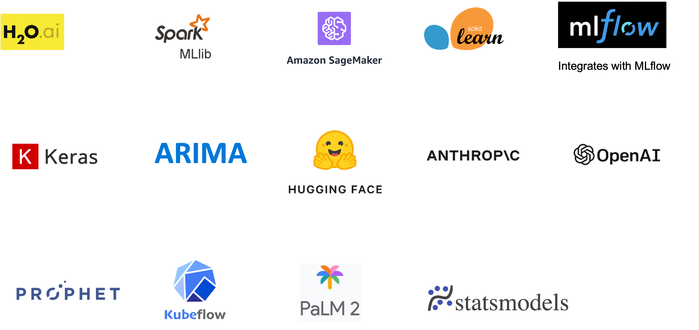

Model Training
===================

ML Engine Libraries
^^^^^^^^^^^^^^^^^^^^^^^^^^^
Sparkflows supports a wide range of libraries for ML Model Training.

- Here our goal is to create segments of households based on the purchase patterns.
- The Adjusted Transaction data created in 'Feature Engineering' stage is fed to the Clustering Model.

.. figure:: ../../_assets/tutorials/solutions/campaign_analytics/campaign_analytics_household_clusters_v1.png
   :alt: Clustering
   :width: 75%
