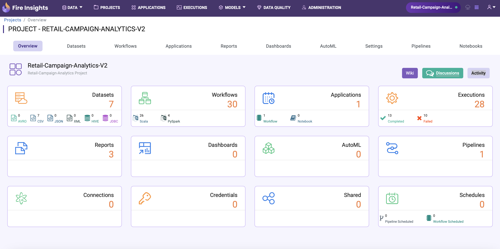
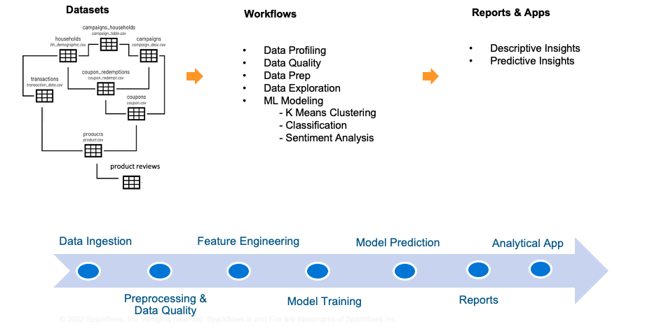
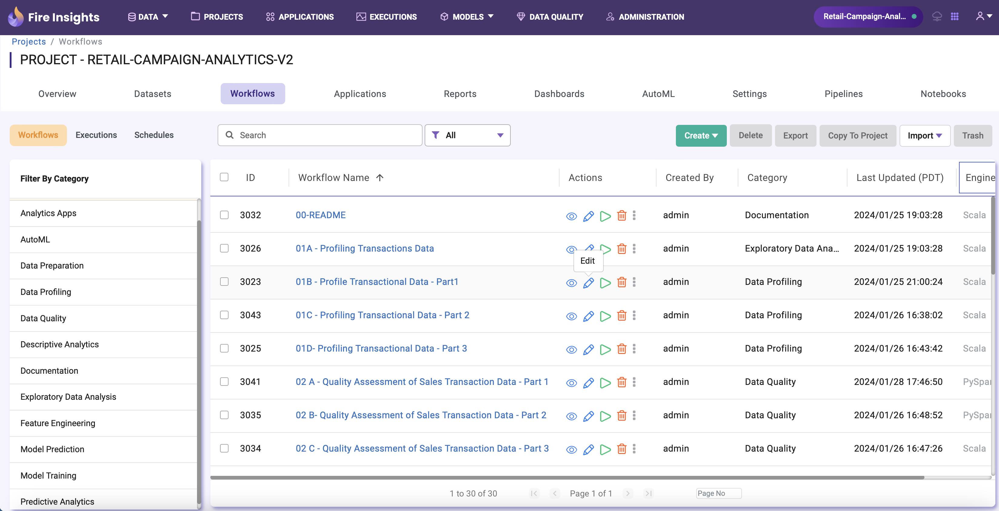

Overview
==================

Maketing Campaign Analytics for Retail Customers.

Objective:
--------
Extract necessary business insights from the responses to promotional offers and coupons by customers participating in marketing campaigns.
Predictive and descriptiove insights will allow the Retail Marketing team to create targeted offers for right customer segments based on the purchase behaviour.

Solution Approach:
--------
Let’s assume the Marketing Team of an organization has completed several promotional campaigns.

- We shall build a Campaign Analytics Solution which can help the Retailers to measure the effectiveness of the campaigns. 
- The solution will provide various functionalities like of Data Profiling, Data Validation, Model Training and Predictive Analytics.
- The solution will identify the target segments of customer households, predict churns (based on historical campaigns, POS and promotional data).
- It also uses Gen-AI features like Huggingface LLM to compute sentiment of store-wise product reviews.
- The solution will recommend key actions that Marketeers can take to drive better campaigns.

Solution Stages:
--------
1. Data Ingestion
2. Data Profiling
3. Data Quality
4. Data Preparation
5. Feature Engineering
6. Model Training
7. AutoML
8. Model Prediction
9. MLOps
10. Predictive Analytics
11. Reports
12. Analytical App

