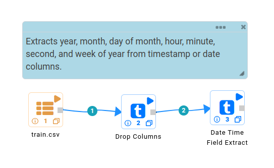
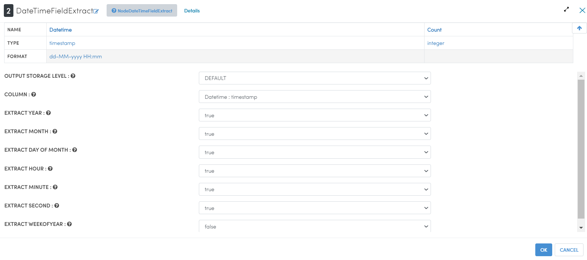
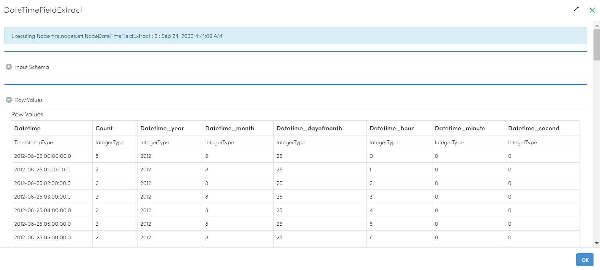
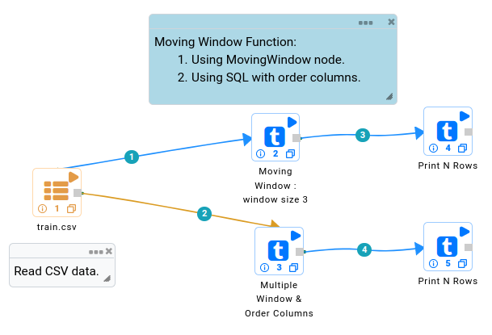
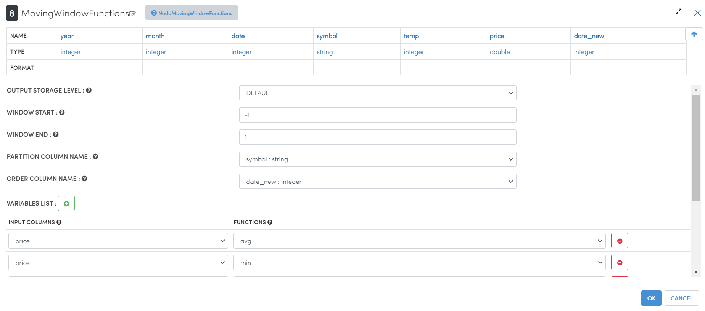
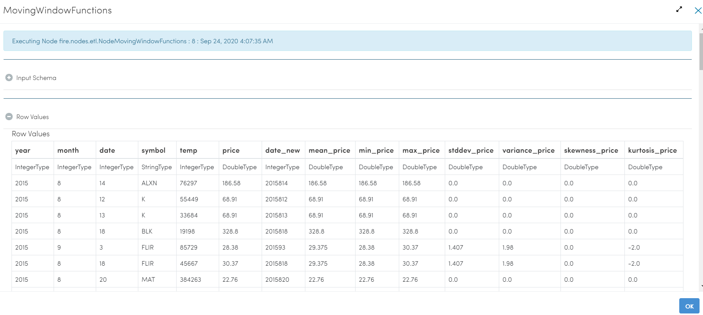

Time Series Feature Engineering
------------------------------

Time series feature engineering is the process of extracting useful features from a time series dataset that can be used as input to a machine learning model. These features can include things like the mean, standard deviation, moving averages, and other statistics that can help capture the underlying patterns in the data.

There are many different techniques that can be used for time series feature engineering, some of which include:

* **Aggregating the data**: This can involve taking the mean, median, or other statistics of the data over a particular time window.
* **Smoothing the data**: This can involve applying techniques like moving averages or exponential smoothing to reduce the amount of noise in the data.
* **Extracting the trend and seasonality**: This can involve using techniques like decomposition, where the time series is decomposed into its trend, seasonal, and residual components.
* **Creating lags and differences**: This can involve creating new features by taking the difference between consecutive time steps, or by lagging the original time series by a certain number of time steps.
* **Creating cyclical features**: This can involve creating new features by extracting the cyclical patterns from the original time series, such as the day of the week or the month of the year.

It's important to remember that the features that you create should be relevant and informative for the problem you are trying to solve, and you may have to experiment with different feature engineering techniques to find the ones that work best for your data. Additionally, it's important to standardize the features before training a model, since some features could have different scales that could affect the training of your model.

Sparkflows provides a number of Processors for Feature Engineering of Time Series Data. Some of them are listed below:

 
.. list-table:: Time Series Processors
   :widths: 10 40
   :header-rows: 1

   * - Features
     - Description
   * - DateTimeFieldExtract
     - Extracts year, month, day of month, hour, minute, second and week of year from timestamp or date columns.
   * - Days to holiday
     - Days remaining for next holiday.
   * - Days from holiday
     - Days passed after holiday.
   * - Time-segmentation
     - Divide data in morning, afternoon, evening, night to get more idea about time based pattern.
   * - MovingWindowFunctions
     - Calculates the moving values using the given function.
   * - WindowAnalytics
     - Implements window functions is mainly through the operators rolling and expanding.
   * - Exponential Moving Average (EMA)
     - The Exponential Moving Average (EMA) assigns a greater weight to the most recent price observations. While it assigns lesser weight to past data, it is based on a recursive formula that includes in its calculation all the past data in our price series.

DateTimeFieldExtract
====================

Below is the sample workflow which contains DateTimeFieldExtract processor in Sparkflows.

It reads a simple Calendar Dataset with a Date Column and uses DateTimeFieldExtract processor to create New DataFrame by extracting Date and Time field and prints the result.

   
**DateTimeFieldExtract Processor Configuration**

**Output result of ``DateTimeFieldExtract`` Processor**

MovingWindowFunctions
========================

Below is the sample workflow which contains MovingWindowFunctions processor in Sparkflows.

It reads the store item dataset, concatenate the input column, cast specified column to new data type, use MovingWindowFunctions processor which calculates the moving value of selected function of input column and print the result. 

**MovingWindowFunctions Processor Configuration**

Moving **avg** and **max** of price column with window size three.

**Output result of MovingWindowFunctions Processor**

