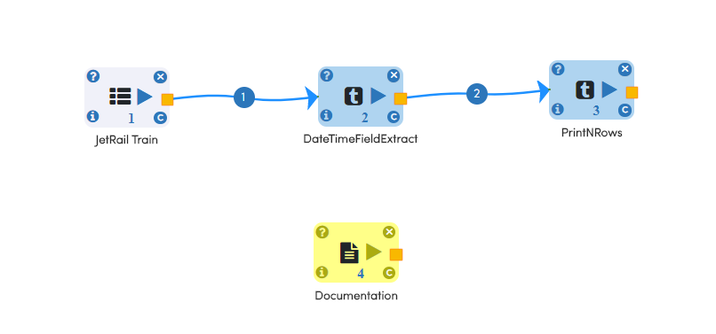
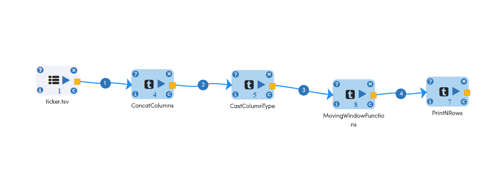

Time Series Feature Engineering
------------------------------

Fire Insights provides a number of Processors for Feature Engineering of Time Series Data. These include:

 
.. list-table:: Update New features where needed
   :widths: 10 40
   :header-rows: 1

   * - Features
     - Description
   * - DateTimeFieldExtract
     - Extracts year, month, day of month, hour, minute, second and week of year from timestamp/date columns
   * - Days to holiday
     - Days remaining for next holiday
   * - Days from holiday
     - Days passed after holiday
   * - Time-segmentation
     - Divide data in morning, afternoon, evening, night to get more idea about time based pattern
   * - MovingWindowFunctions
     - Calculates the moving values using the given function
   * - WindowAnalytics
     - Implements window functions is mainly through the operators rolling and expanding
   * - Exponential Moving Average (EMA)
     - The Exponential Moving Average (EMA) assigns a greater weight to the most recent price observations. While it assigns lesser weight to past data, it is based on a recursive formula that includes in its calculation all the past data in our price series.

DateTimeFieldExtract
====================

Below is the sample workflows which contains ``DateTimeFieldExtract`` processor in Fire Insights.

It reads a simple Calendar Dataset with a Date Column & uses DateTimeFieldExtract processor to create New DataFrame by extracting Date & Time field and print the result.

   
**DateTimeFieldExtract Processor Configuration**

.. figure:: ../../_assets/ml_userguide/datetime_configuration.PNG
   :alt: ml_userguide
   :width: 90%

**Output result of ``DateTimeFieldExtract`` processor**

.. figure:: ../../_assets/ml_userguide/datetime_output_result.PNG
   :alt: ml_userguide
   :width: 90%

MovingWindowFunctions
========================

Below is the sample workflows which contains ``MovingWindowFunctions`` processor in Fire Insights.

It reads the store item dataset, concatenate the input column, cast specified column to new data type, use MovingWindowFunctions processor which calculates the moving value of selected function of input column and print the result. 

**MovingWindowFunctions processor Configuration**

Moving avg and min of price column with window size three.

.. figure:: ../../_assets/ml_userguide/windows_configuartion.PNG
   :alt: ml_userguide
   :width: 90%

**Output result of ``MovingWindowFunctions`` processor**

.. figure:: ../../_assets/ml_userguide/output-result.PNG
   :alt: ml_userguide
   :width: 90%

