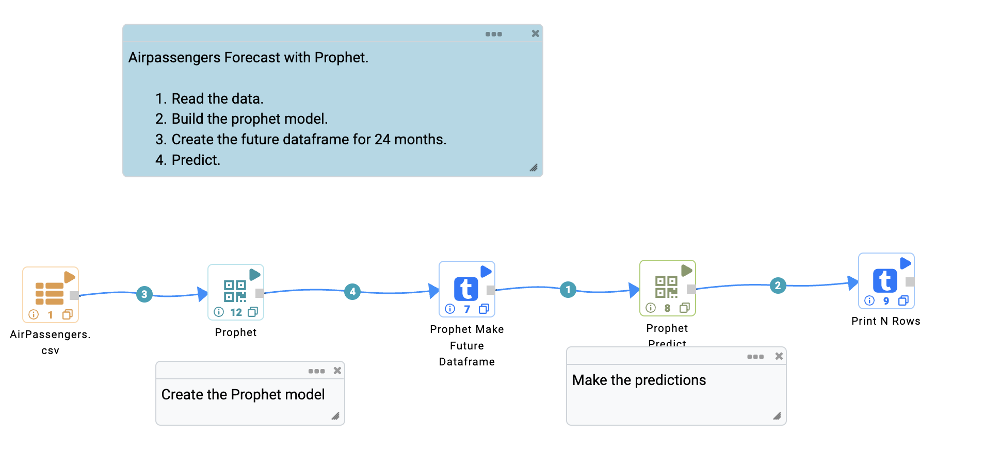
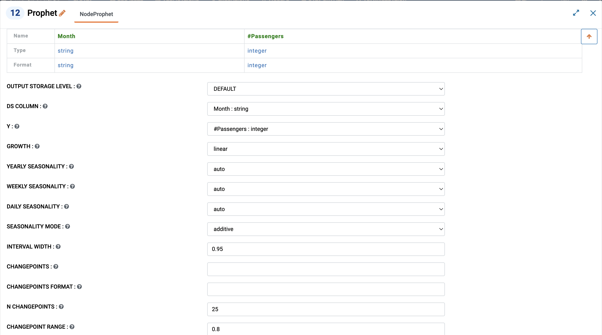
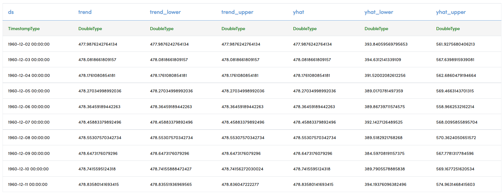
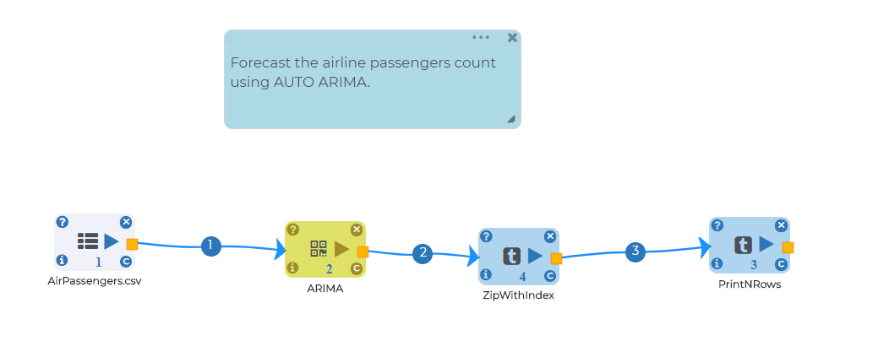
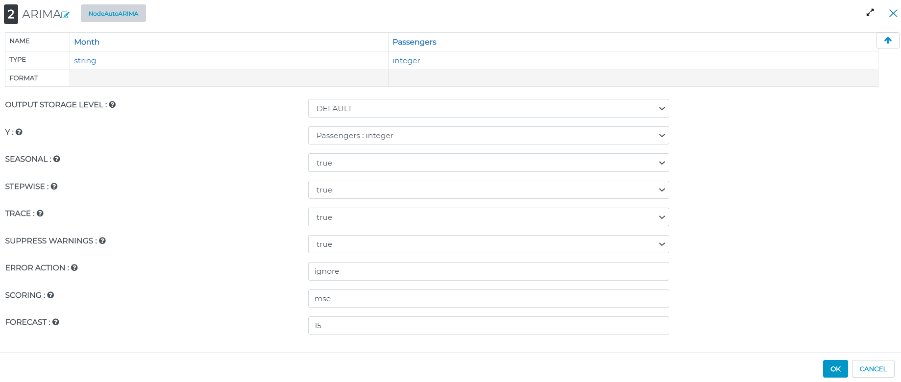
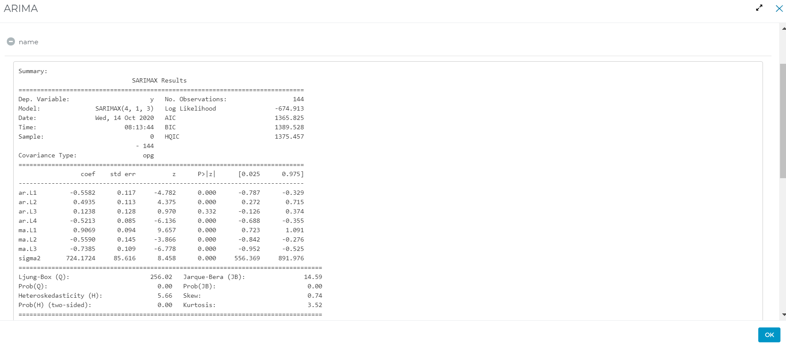
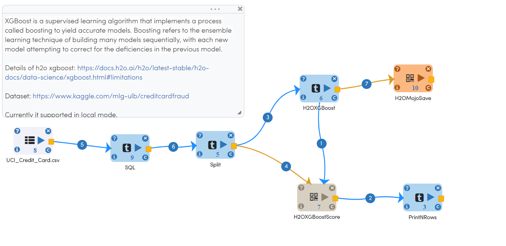
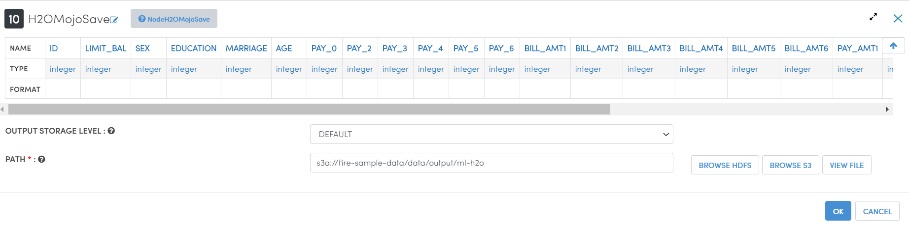
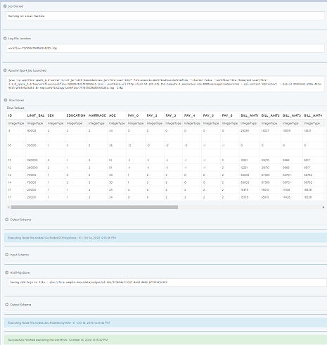
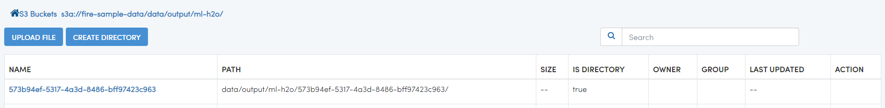

Time Series Modeling
--------------------

Fire Insights provides a number of Processors for Time Series Modeling. These include:

.. list-table:: Update New features where needed
   :widths: 10 40
   :header-rows: 1

   * - Models
     - Description
   * - Prophet
     - Prophet is a procedure for predicting time series data based on an additive or multiplicative model where non-linear trends are fit with yearly, weekly, and daily seasonality, plus holiday effects. It is best for time series that have strong seasonal effects and several seasons of historical data. Prophet is robust model to missing data and shifts in the trend, and able to handles outliers. For more: https://facebook.github.io/prophet/

   * - Arima
     - ARIMA is a model which is used for predicting future trends on a time series data. It is model that form of regression analysis. For more: https://en.wikipedia.org/wiki/Autoregressive_integrated_moving_average

   * - XGBoost
     - XGBoost is gradient boosting algorithm. It is also known as ‘regularized boosting‘ technique - seeks a goot bias-variant trade-off to reduce overfitting allows cross-validation at each iteration of the boosting process and thus it is easy to get the exact optimum number of boosting iterations in a single run. For more: https://docs.h2o.ai/h2o/latest-stable/h2o-docs/data-science/xgboost.html#limitations

   * - LSTM
     - LSTM is special kind of recurrent neural network that is capable of learning long term dependencies in data. This is achieved because the recurring module of the model has a combination of four layers interacting with each other. This is a great benefit in time series forecasting, where classical linear methods can be difficult to adapt to multivariate or multiple input forecasting problems. For more: https://www.tensorflow.org/tutorials/structured_data/time_series

Prophet
=======

Below is the sample workflows which contains ``Prophet`` processor in Fire Insights.
 
 **Equation - y(t)=g(t)+s(t)+h(t)+ϵt**, 
 
 where: 
 
 * Trend g(t): models non-periodic changes
 
 * Seasonality s(t): represents periodic changes 
 
 * Holidays component h(t): contributes information about holidays and events

It reads the AirPassengers dataset & uses Prophet processor for forecasting of univariate time series data and finally prints the result.

Prophet processor Configuration:

   
Output result of ``Prophet`` after model:  

ARIMA
=====

Below is the sample workflow which contains ``ARIMA`` processor in Fire Insights.

* AR (Autoregression): A changing variable that regresses on its own lagged/prior values.

* I (Integrated): Differencing of raw observations to allow for the time series to become stationary

* MA (Moving average): Dependency between an observation and a residual error from a moving average model

In terms of y, the general forecasting equation is:

**ŷt = μ + ϕ1 yt-1 +………+ ϕp yt-p — θ1et-1 -………- θqet-q**,

where:

* μ → constant

* ϕ1 yt-1 +…+ ϕp yt-p → AR terms (lagged values of y)

* θ1et-1 -………- θqet-q → MA terms (lagged errors)

It reads the AirPassengers dataset & use ARIMA processor which Forecast the airline passengers count, generate a new column with unique index/value for each row in dataset and print the result.

   
ARIMA processor Configuration:

   
Output result of ``ARIMA`` processor:     

H2OXGBoost
==========

Below is the sample workflow which contains ``H2OXGBoost`` processor in Fire Insights.

It reads the UCI_Credit_Card dataset & use H2OXGBoost processor supervised learning algorithm that implements a process called boosting to yield accurate models and save the model in s3 location.

H2OXGBoost processor Configuration:

.. figure:: ../../_assets/ml_userguide/xgboost_config.PNG
   :alt: ml_userguide
   :width: 90%

H2OMojoSave processor Configuration:

On successful submission of the job, the model get saved to specified locations, you can just view the model at specified location.

