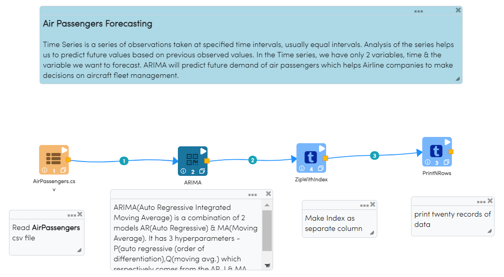
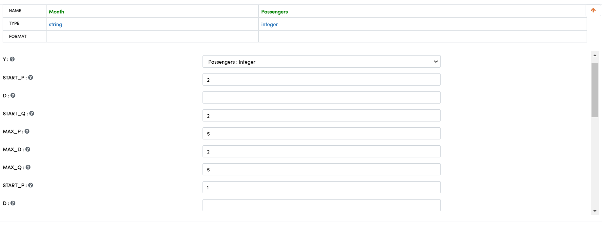
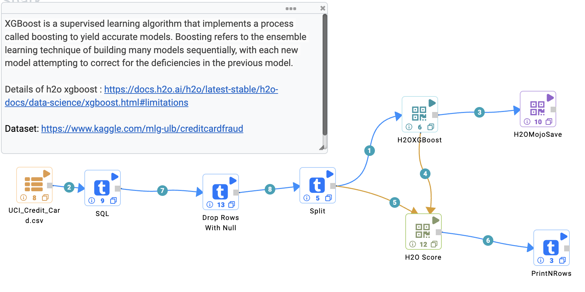
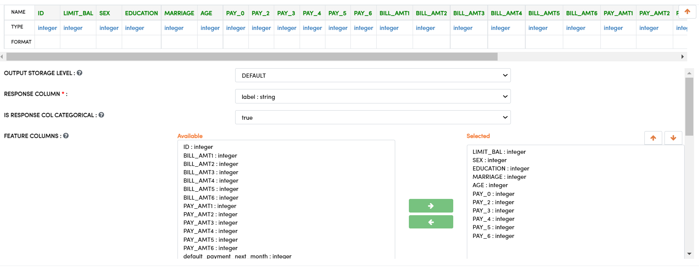
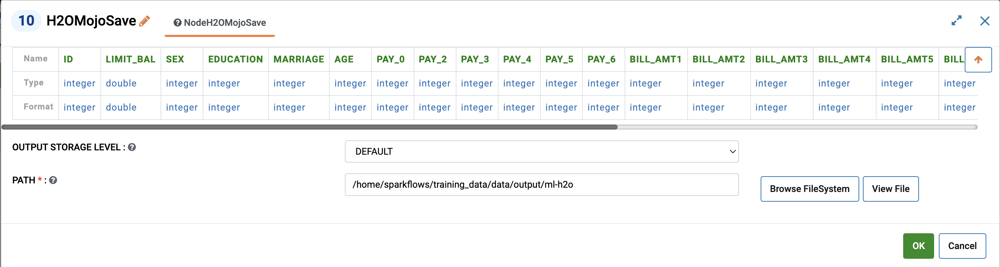
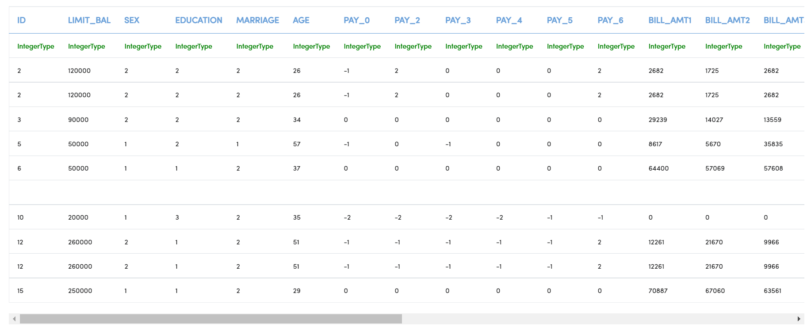

Time Series Modeling
--------------------

Sparkflows provides a number of Processors for Time Series Modeling. These include:

.. list-table:: Update New features where needed
   :widths: 10 40
   :header-rows: 1

   * - Models
     - Description
   * - Prophet
     - Prophet is a procedure for forecasting time series data based on an additive model where non-linear trends are fit with yearly, weekly, and daily seasonality, plus holiday effects. It works best with time series that have strong seasonal effects and several seasons of historical data. Prophet is robust to missing data and shifts in the trend, and typically handles outliers well. More details can be found: https://facebook.github.io/prophet/

   * - ARIMA
     - ARIMA is a model used for predicting future trends on a time series data. The Sparkflows integrates the python wrapper of R's best package `auto.arima`. One can use Sparkflows processors to model univariate as well as multivaraite data. The Sparkflows porcessors can figure out the hyper-parameters via grid search to give the user best values of (p,q,d,P,Q,D) based on optimizing for AIC/BIC. This reduces the overhead of the user to manually find these parameteres which at time can be challenging. The More details can be found: https://alkaline-ml.com/pmdarima/about.html#about

   * - SARIMAX
     - SARIMAX is a statistical model for time series data that combines the strengths of the Seasonal AutoRegressive Integrated Moving Average (SARIMA) model and the eXogenous (X) factor model. It is commonly used to model time series data that exhibits both seasonality and autoregressive dependencies. The SARIMAX model is particularly useful for forecasting future values in a time series, as it can account for both the past values in the series and the periodic patterns that may exist.The SARIMAX model is an extension of the ARIMA model, which is used to model time series data that exhibit autoregressive dependencies. Sparkflows integrates with the state of art SARIMAX library available in statsmodels package. SARIMAX can be used to build models on univariate as well as multivaraite data. More details can be found: https://www.statsmodels.org/v0.13.0/statespace.html

   * - VAR
     - VAR, or Vector Autoregression, is a statistical model used to describe the linear interdependence between multiple time series. It is a multivariate extension of the univariate autoregressive model, and can be used to analyze the dynamic relationships between multiple variables over time. VAR models are widely used in economics, finance, and other fields. Sparkflows integrates with the state of art VAR library available in statsmodels package. More details can be found: https://www.statsmodels.org/dev/vector_ar.html
     
   * - XGBoost
     - XGBoost is gradient boosting algorithm which can be used to model time series data after computing features like lags, moving averages, time based features among others. It is also known as regularized boosting technique - seeks a goot bias-variant trade-off to reduce overfitting allows cross-validation at each iteration of the boosting process and thus it is easy to get the exact optimum number of boosting iterations in a single run. For more: https://xgboost.readthedocs.io/en/stable/

   * - LSTM
     - Long Short-Term Memory (LSTM) is a type of recurrent neural network (RNN) that is trained using Backpropagation Through Time (BPTT) and can learn long-term dependencies. LSTM networks are well-suited to classifying, processing and making predictions based on time series data, since there can be lags of unknown duration between important events in a time series. LSTMs are composed of a cell, input gate, forget gate and output gate. The cell remembers values over arbitrary time intervals and the three gates regulate the flow of information into and out of the cell. They are particularly useful for tasks that require the network to remember and use information from long periods of time in the past. For more: https://www.tensorflow.org/tutorials/structured_data/time_series

Prophet
=======

Below is the sample workflows which contains ``Prophet`` processor in Fire Insights.
 
 **Equation - y(t)=g(t)+s(t)+h(t)+ϵt**, 
 
 where: 
 
 * Trend g(t): models non-periodic changes
 
 * Seasonality s(t): represents periodic changes 
 
 * Holidays component h(t): contributes information about holidays and events

It reads the AirPassengers dataset & uses Prophet processor for forecasting of univariate time series data and finally prints the result.

.. figure:: ../../_assets/ml_userguide/fbprophet.PNG
   :alt: ml_userguide
   :width: 90%

Prophet processor Configuration:

.. figure:: ../../_assets/ml_userguide/fbprophet_processor.PNG
   :alt: ml_userguide
   :width: 90%
   
.. figure:: ../../_assets/ml_userguide/fbprophet_processor2.PNG
   :alt: ml_userguide
   :width: 90%
Output result of ``Prophet`` after model:  

.. figure:: ../../_assets/ml_userguide/fbprophet_result.PNG
   :alt: ml_userguide
   :width: 90%

ARIMA
=====

Below is the sample workflow which contains ``ARIMA`` processor in Fire Insights.

* AR (Autoregression): A changing variable that regresses on its own lagged/prior values.

* I (Integrated): Differencing of raw observations to allow for the time series to become stationary

* MA (Moving average): Dependency between an observation and a residual error from a moving average model

In terms of y, the general forecasting equation is:

**ŷt = μ + ϕ1 yt-1 +………+ ϕp yt-p — θ1et-1 -………- θqet-q**,

where:

* μ → constant

* ϕ1 yt-1 +…+ ϕp yt-p → AR terms (lagged values of y)

* θ1et-1 -………- θqet-q → MA terms (lagged errors)

It reads the AirPassengers dataset & use ARIMA processor which Forecast the airline passengers count, generate a new column with unique index/value for each row in dataset and print the result.

   
ARIMA processor Configuration:

   
Output result of ``ARIMA`` processor:     

.. figure:: ../../_assets/ml_userguide/arima_result.PNG
   :alt: ml_userguide
   :width: 90%

H2OXGBoost
==========

Below is the sample workflow which contains ``H2OXGBoost`` processor in Fire Insights.

It reads the UCI_Credit_Card dataset & use H2OXGBoost processor supervised learning algorithm that implements a process called boosting to yield accurate models and save the model in s3 location.

H2OXGBoost processor Configuration:

H2OMojoSave processor Configuration:

On successful submission of the job, the model get saved to specified locations, you can just view the model at specified location.

.. figure:: ../../_assets/ml_userguide/modellocation.PNG
   :alt: ml_userguide
   :width: 100%

