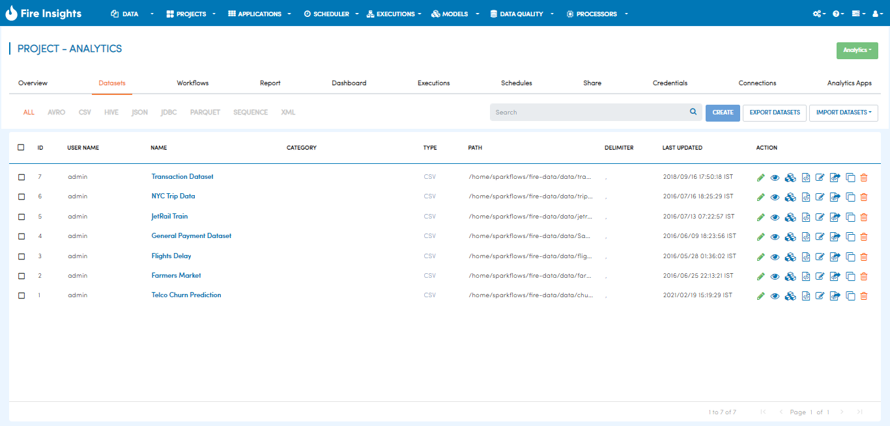
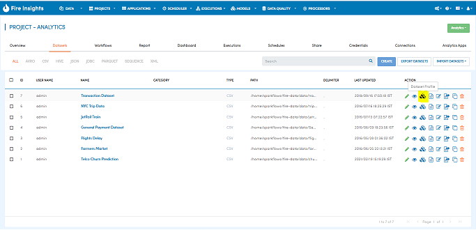
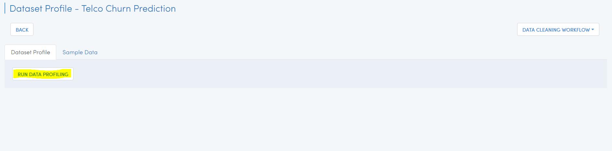
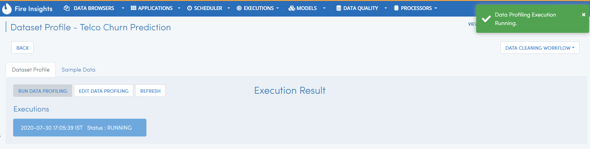
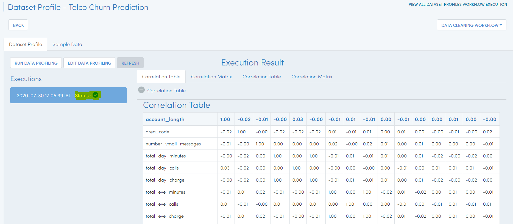
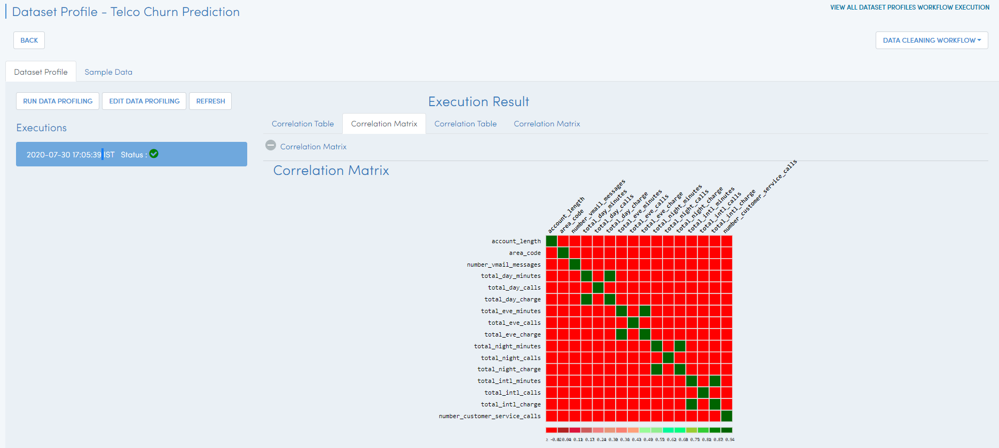

Data Profiling
==============

Fire Insights allows you to clean the datasets using dataset profile.

Below are the steps for Data Profiling in Fire.

Go to the Projects Page
^^^^^^^^^^^^^^^^^^^^^^^^^^^

Go to project page where you need to create dataset or already have existing.

select ``dataset`` tab.

Select a dataset & under ``action`` icon choose Dataset profile.

Once you Click on Dataset profile, it will take us to next page.

Click on ``RUN DATA PROFILING`` option

Once you click on above option, will get notifications about process is getting started.

Once the ``execution`` process completed, after refresh the status will updated to green, if its completed and check its execution result in RHS

