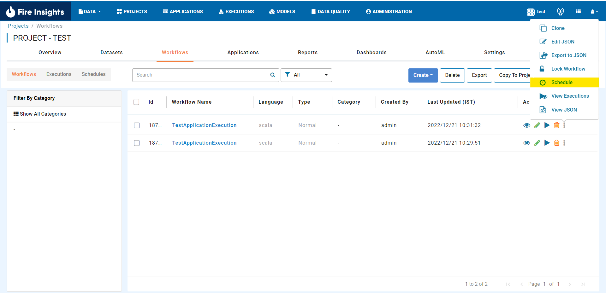
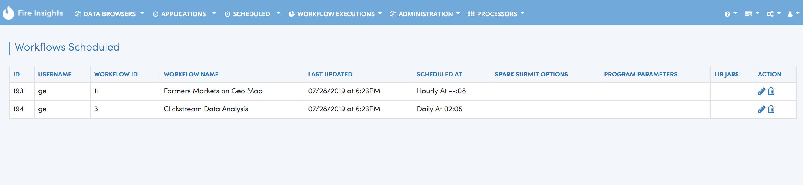
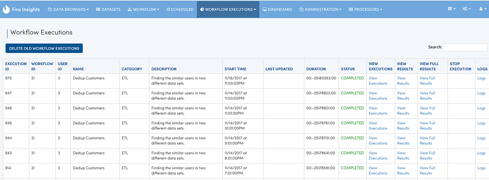

Scheduling Workflows
====================

Fire allows you to schedule workflows to be run at regular intervals.

Scheduling New Workflow
-----------------------

The workflows page displays the list of various workflows.

On the workflows page ``Action`` column, there is an menu to schedule any given workflow.

Clicking on the schedule takes you to a page for creating new schedules for the workflow.

   

Viewing Workflows Scheduled
-------------

Scheduled/By Time page displays the various workflows scheduled.

Editing a Scheduled Workflow
----------------------------

You can edit a schedule by clicking on the edit icon, updating the new values, and saving it.

Viewing Results of the Workflow Executions
--------------------------------------

When workflows are scheduled, they are executed by Fire at the specified schedule.

The results of the execution of the workflows can be viewed in the Workflow Executions Page. This allows us to view the results of past execution, logs of the run, etc.

Deleting a Scheduled Workflow
-----------------------------

Go to the Scheduled/By Time page. It would display the list of scheduled workflows.

Click on the delete icon next to any schedule workflow to delete the schedule.
