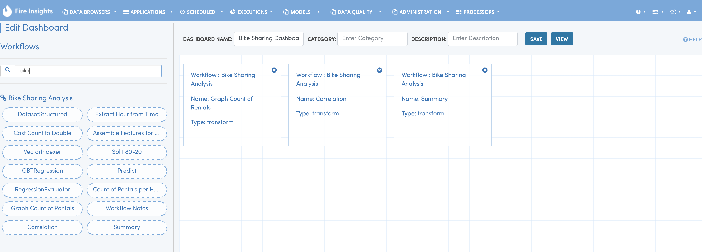
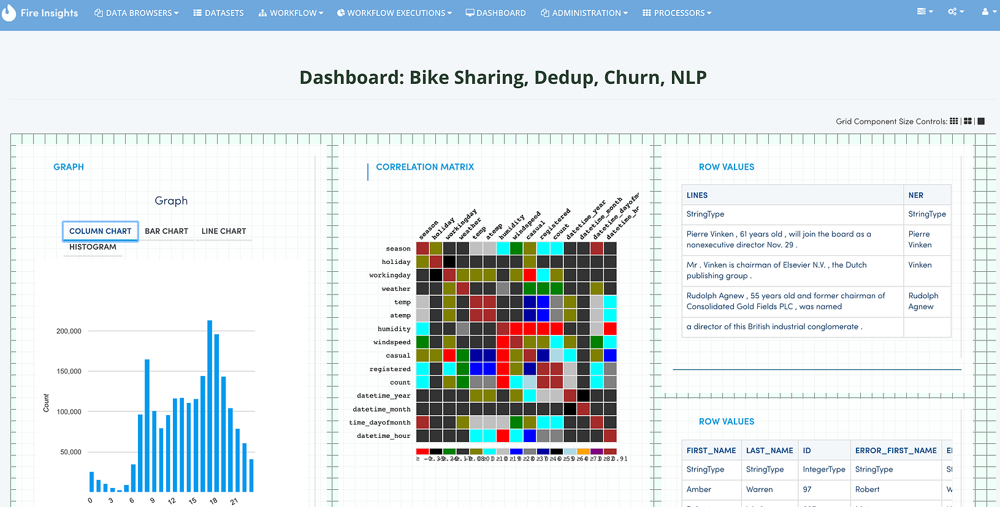

Reports
=======================

Sparkflows allows you to create Reports based of an assortment of data.

Processors in Sparkflows can output data in tables, charts, maps and simple strings. Reports allow combining of the output of various processors into one User Interface.

For example, we might want to output a chart of the number of bike rentals per hour, another by per day and another map displaying the total number of bike rentals per city for the day. Report can combine all these into one view.
 
Creating Reports
--------------------
 
- For creating reports, drag and drop the required processors from the workflows into the Report Canvas.
- When the corresponding workflows are run, the output is stored by Sparkflows into the relational store. These get displayed in the Report.
 
Editing Reports
------------------

Editing reports is like creating them, except that you click the edit button to edit the corresponding report.
 

   
   
Viewing Reports
------------------

Once a report has been created, you can view it by clicking on the 'View' button.
  

   
Streaming Reports
---------------------
 
- Sparkflows allows you to create streaming workflow.
- The streaming workflows have a mini-batch duration, say 30 seconds.
- In this case, the output in the reports gets updated every 30 seconds as the new data comes in.

