Dashboards
=======================

Fire Insights allows creating of the Dashboard.

You can create new datasets using JDBC data type from MYSQL DB using connection & then uses the datasets in creating charts & dashboards.

Creating Dashboard
--------------------

- For creating a Dashboard, you need to create MySQL Connection and then create a JDBC dataset using it.

You can define a new dataset by clicking on the ``Create Dataset`` button Using Connections option on the Dataset page.

It will bring up the dialog box below. Select the MySQL Connection being used for creating dataset.

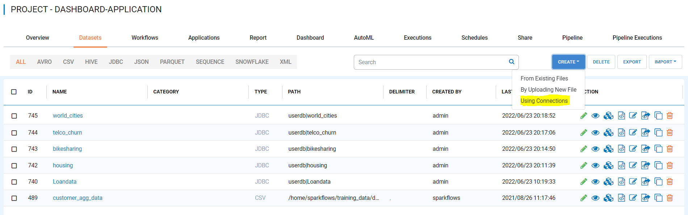

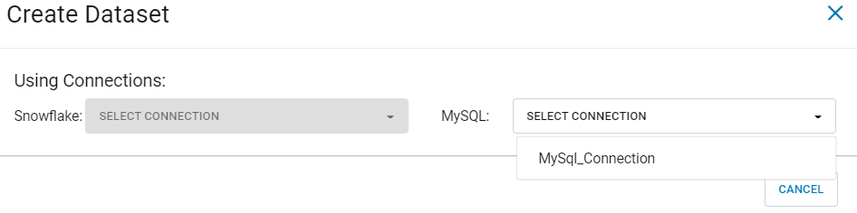

Entering Field Details
^^^^^^^^^^^^^^^^^^^^

Below are the details of the fields in the ``Create Dataset`` page:

- **NAME**: Name of the New Dataset we are creating.
- **DESCRIPTION**: Description of the New Dataset.
- **CATEGORY**: Category of the New Dataset.
- **DB**: Database for MYSQL DB.
- **TABLE**: Table for MYSQL.

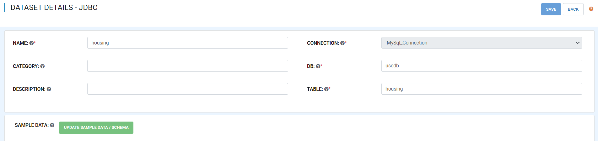

Updating the Schema of the Dataset
^^^^^^^^^^^^^^^^^^^^

You can update the Schema of the Dataset by clicking on ``Update Sample Data/Schema``. It would display sample data for the dataset followed by the Schema inferred by Fire Insights.

You can update the column names in the schema based on your data.
 
 .. figure:: ../../../_assets/tutorials/dataset/jdbc_schema.PNG
   :alt: Dataset
   :width: 80%

Saving the New Dataset
^^^^^^^^^^^^^^^^^^^^

Click on the ``Save`` button to save the New Dataset created.

Dashboard
^^^^^^^^^^^^^^^^^^^^^^

Click on the ``Dashboard`` tab in the same application where you have created JDBC Dataset.

 .. figure:: ../../../_assets/tutorials/dataset/jdbc-dashboard.PNG
   :alt: Dataset
   :width: 80%

Click on the ``Chart`` tab & select Choose a JDBC dataset, there you will find all JDBC datasets created under your application.

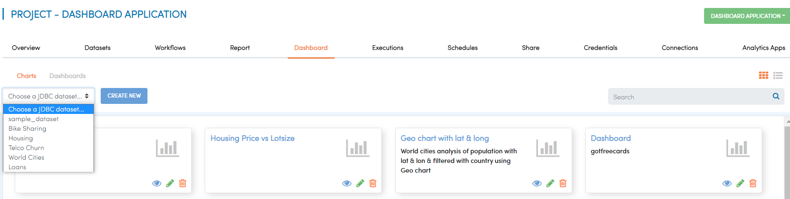

Select any JDBC dataset for which you want to create ``Chart`` & select ``CREATE NEW``

It will take you to the new page, as below

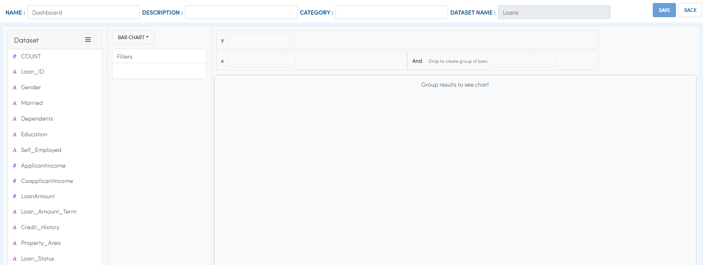

Select the ``Chart Type``, you want to see chart

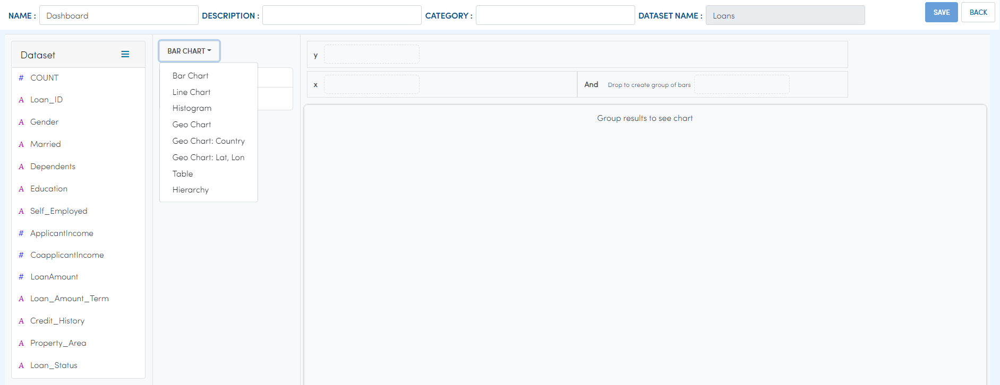

Selected ``Bar Chart`` & updated column for x & y axis and add some filter

Add NAME, DESCRIPTION & save it

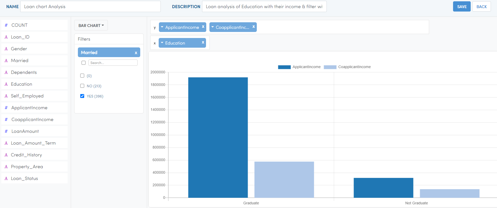

Once you save it, the chart will appear on the chart list page

Similarly, you can create a different chart using a specified chart type

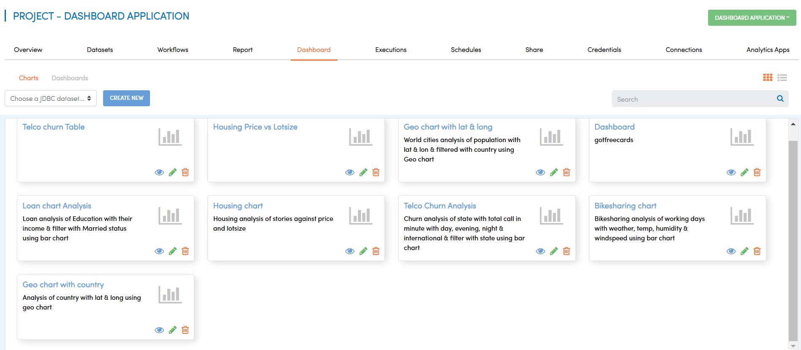

Now using an existing chart, you can create a new dashboard 

Select the ``Dashboard`` tab & Click on CREATE DASHBOARD

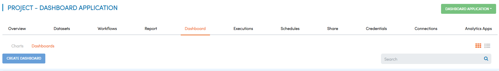

It will take you to the New Dashboard page

.. figure:: ../../../_assets/tutorials/dataset/chart-dash1.PNG
   :alt: Dataset
   :width: 80%

Using drag & drop you need to add a chart in canvas, Add NAME, DESCRIPTION & SAVE it.

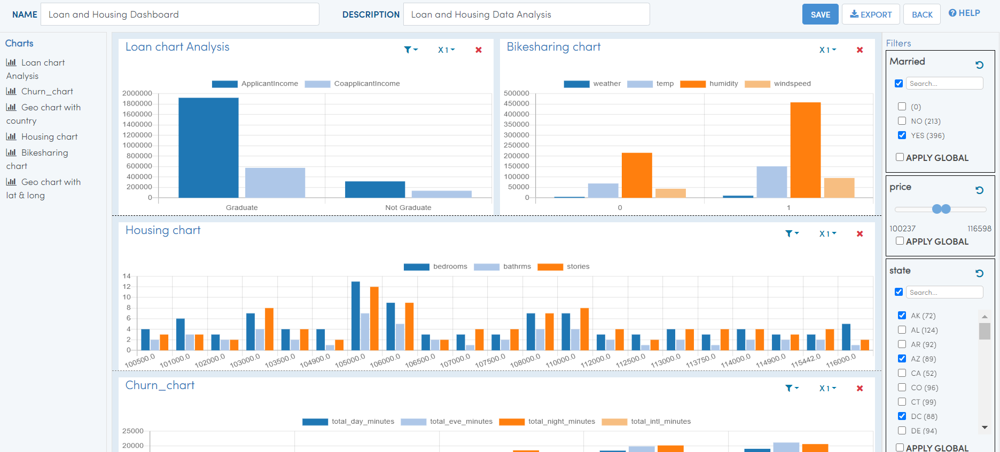

Once the Dashboard got saved successfully, it will show on the dashboard list page from where you can view, edit & delete it.

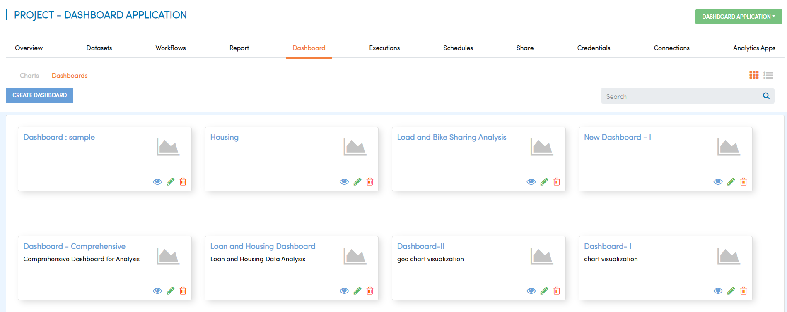
