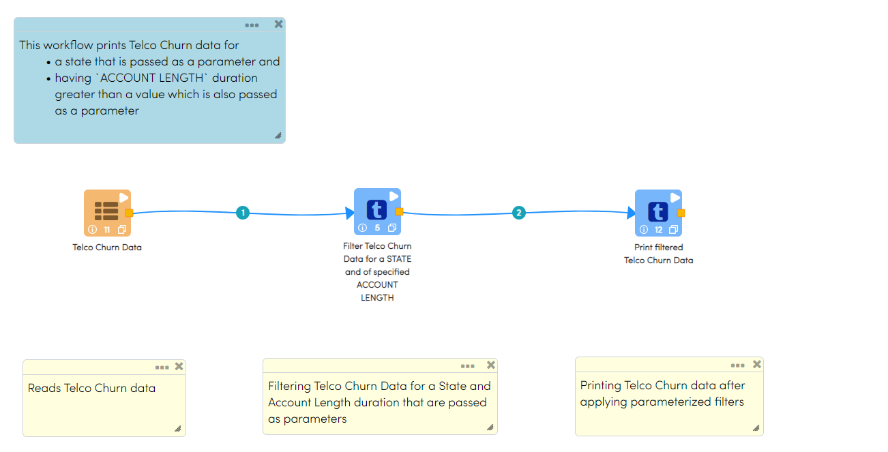
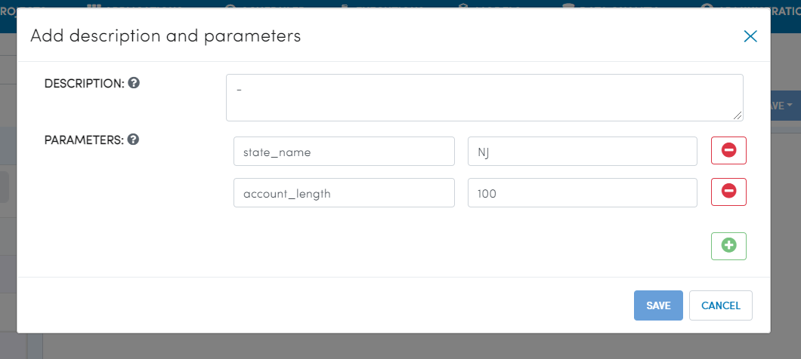
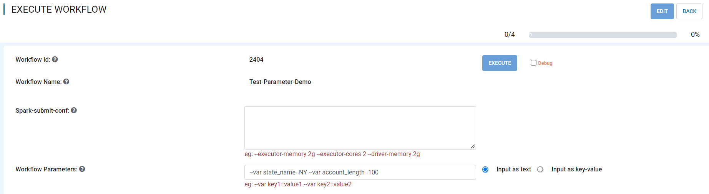
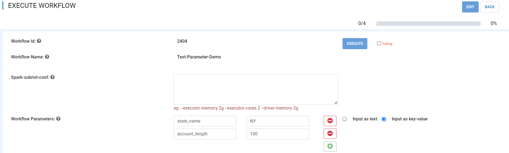

Passing Parameters to Workflows
===============================

Fire Insights runs the spark jobs with ``spark-submit``. It takes in the workflow JSON as a parameter. There are multiple ways to pass extra parameters to the workflow. If the same parameter is specified multiple times, the order of precedence in which they are applied is as shown below:
 
  * Through Workflow Parameters passed during the workflow execution.
  * By specifying the parameters in the Workflow Editor.
  * Through a Specify Parameter Processor in the workflow.
  * A node creating a variable during the execution time.

By specifying the Parameters in the Workflow Editor
---------------------------------------------------

Parameters can be specified in the Workflow Editor which is demonstrated below

This example prints Telco Churn data for

* a `STATE` that is passed as a parameter and
* having `ACCOUNT LENGTH` duration greater than a value which is also passed in as a parameter

Workflow
^^^^^^^^^^^^^^^^^^

Workflow performs following processing:

* Defines parameters for `State` and `Account Length`
* Reads data from a Dataset (Telco Churn Data)
* Filters Telco Churn Data for a `State` and `Account Length` duration that are passed in as parameters
* Prints filtered Telco Churn data
   

   
Defining Parameters
^^^^^^^^^^^^^^^^^^

Parameters can be added by clicking on the Plus icon next to Workflow Category field.

Two Parameters have been defined and initial values have been set which can be changed based on the need:

* state_name
* account_length

Processor Configuration
^^^^^^^^^^^^^^^^^^
   

   
Reading from Dataset
^^^^^^^^^^^^^^^^^^

It reads the input Dataset File (Telco Churn Data).

.. figure:: ../../../_assets/user-guide/passing-parameters/Dataset_Data.png
   :alt: Passing Parameters
   :width: 100%
   
Row Filter Node
^^^^^^^^^^^^^^^^^^

* This node filters incoming Telco Churn dataset based on following parameterized condition:

	* `STATE` = '$state_name' AND `ACCOUNT LENGTH` > $account_length AND CHURN = 'True'
		
	* $state_name and $account_length are parameters that are passed to the workflow
	
	* Filter Node would create an outgoing Dataset comprising of filtered Telco Churned Data.

.. figure:: ../../../_assets/user-guide/passing-parameters/RowFilter_Parameter.png
   :alt: Passing Parameters
   :width: 100%
   
 
Print N Rows Node
^^^^^^^^^^^^^^^^^^

This node prints filtered Telco Churn data after applying parameterized filters

.. figure:: ../../../_assets/user-guide/passing-parameters/Print_Node_Parameter_Output.png
   :alt: Passing Parameters
   :width: 100%
   
Through Workflow Parameters in Fire during Workflow Execution
---------------------------------------------------   
   
Parameters can be passed to Fire during the workflow execution. Parameters values set during Workflow Execution would override values set in Workflow Editor Parameter page.

Workflow Parameters during Execution can be set using below options:

*	Input As Text

   
*	Input As Key-Value

   
Through a Specify Parameters Processor in the Workflow
---------------------------------------------------   
   
Parameters can be passed to Fire using Specify Parameters Processor in Workflow.

*	Parameters can be defined using Specify Parameters Processor

.. figure:: ../../../_assets/user-guide/passing-parameters/specifyparam_processor.png
   :alt: Passing Parameters
   :width: 100%
   
*	Defined Parameter can be used in processors like Row Filter processors to filter rows based on parameter value set

.. figure:: ../../../_assets/user-guide/passing-parameters/specifyparam_rowfilter.png
   :alt: Passing Parameters
   :width: 100%
   
*	Value of the parameter can be set during Workflow Execution.

.. figure:: ../../../_assets/user-guide/passing-parameters/specifyparam_setatexec.png
   :alt: Passing Parameters
   :width: 100%
   
A Processor creating a Variable during Execution Time
------------------------------------------------

A processor can also create a parameter during the run time. A processor creates a new variable and puts it into the JobContext.

jobContext.nodeGeneratedParameters.put(variable, count);

This parameter can later be used by another processor.

For example ``NodeCount`` puts the count of records into a variable in the JobContext.

``NodeAssert`` uses this variable when evaluating expressions.

   
Through ``--var`` Parameters with Spark-Submit
--------------------------------------------------
 
Fire Insights workflow can also be directly executed on the cluster with Spark-Submit.

In this case, extra parameters can be passed with ``--var``::

 
    spark-submit    --class fire.execute.WorkflowExecuteFromFile    --master yarn    --deploy-mode client   fire-core-3.1.0-jar-with-dependencies.jar    --postback-url http://<machine>:8080 --job-id 1      --workflow-file kmeans.wf    --var name1=value1  --var  name2=value2

 
In the workflow, these parameters can be used with ``$name1    $name2``.
 
Specific nodes make use of the parameters by substituting `$name` with the value provided for the name.

An example would be:     ``--var id=3``.

When specifying the expression in the RowFilter Node we can use:   ``id > $id``.

In the above `$id` would be replaced with `3`.
 
 

Specifying ``--var`` Parameters for all in Sparkflows User Interface
-----------------------------------------------------------------
 
Sparkflows also allows specifying the **--var** parameters to be passed to all the jobs submitted through Sparkflows. Below is the screen under Administration/Configuration.

.. figure:: ../../../_assets/user-guide/passing-parameters-3.png
   :alt: Passing Parameters to Workflows
   
In the above, **app.vars** parameter allows specifying a space-separated list of `name=value` pairs. 

Each of these are passed to the jobs submitted by Sparkflows with ``--var name=value``.
