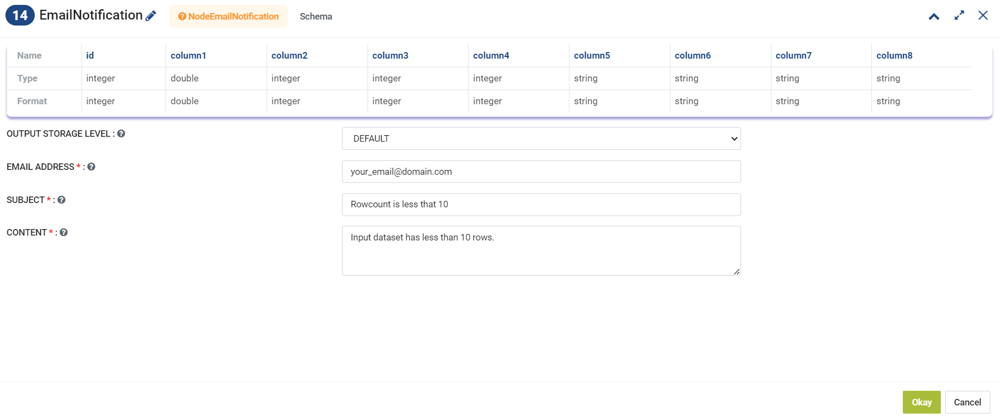
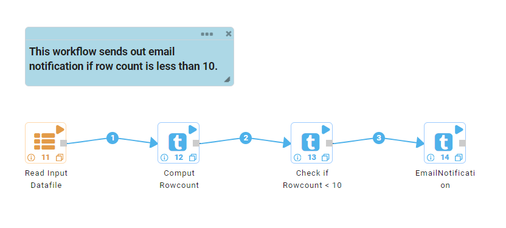

Email Notification
==========

Sparkflows provides a node to send Email Notification.

* **Email Notification** processor can be used to send email notification.

**Email Notification** processor can be configured as below.
------------------

* **Email Address:** Enter comma separated email addresses that are intended to receive email notification.
* **Subject:** Enter Subject of the email.
* **Content:** Enter body of the email. 

Workflow
------------------

* A sample workflow using **Email Notification** processor to send email notification can be created as below.
* This workflow sends email notification if input dataset contains less than 10 rows.

