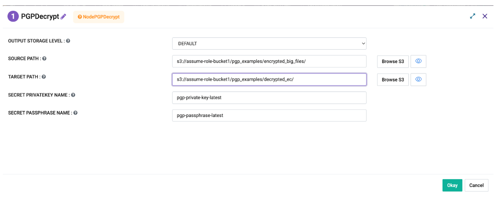
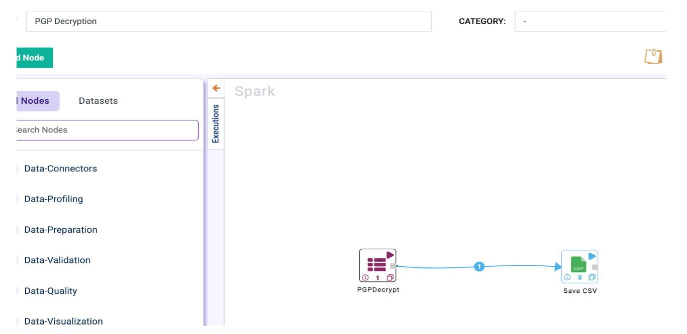

PGP Decryption
==========

Sparkflows provides a node to decrypt the PGP files in the source location and copy the decrypted files to the target location in S3. Output Dataframe of the node contains the location of decrypted files along with count(schema: filename & count).

* **PGP Decryption** processor can be used to decrypt the PGP files.

**PGP Decryption** processor can be configured as below.
------------------

* **SourceDir:** Encrypted files directory to copy the files from
* **TargetDir:** Upload the decrypted files to.
* **SecretPrivateKeyName:** key secret name 
* **SecretPassphraseName:** passphrase secret name

Workflow
------------------

* A sample workflow using **PGP Decryption** processor to decrypt PGP Files can be created as below.
* This workflow reads encrypted files from a directory. It decrypts the files and saves them onto the Target directory.
* It uses the Save CSV node to save the OutputFileName and Count information.

