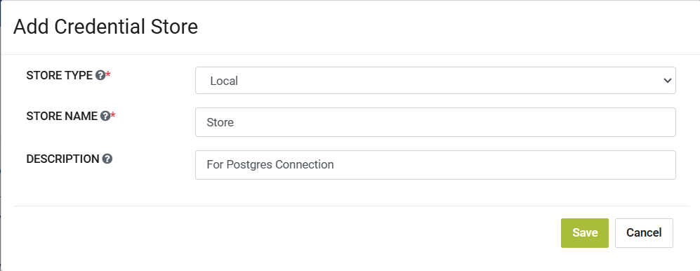
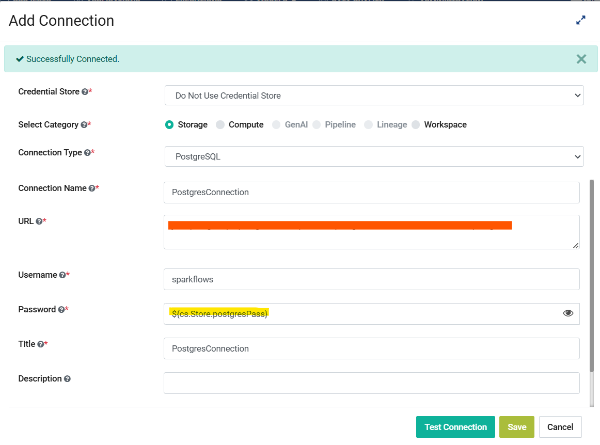
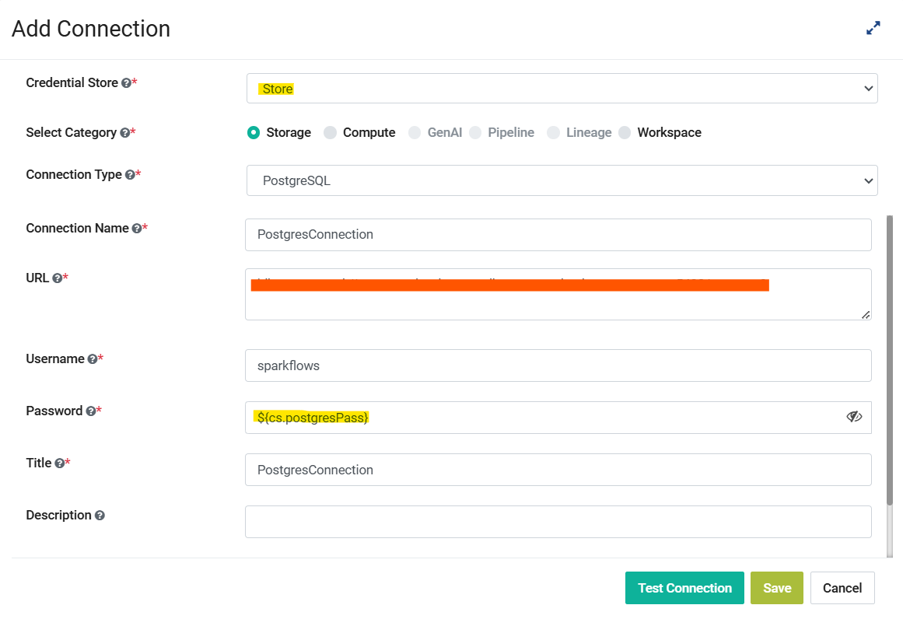
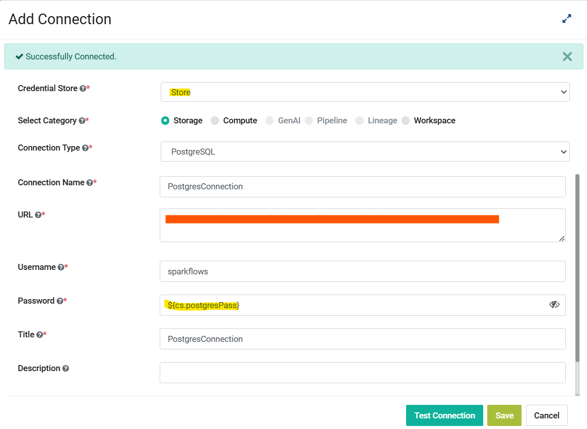

Macros in Application Connection
==================

**Macros** can be accessed by the Sparkflows Application Connections as well. They can be added to any of the fields while Add/Edit of connection. These macros are associated to Credential Store of Type **Local** only.

Macros that Sparkflows supports for Application Connection
++++++++++++++++++++++++++++++

.. list-table:: 
   :widths: 30 70
   :header-rows: 1

   * - Macro
     - Description
   * - ${cs.StoreName.CredentialKey}
     - Returns the credential value set for the **CredentialKey** that is associated to the Local Credential Store **StoreName**. If we use this macro we can 
       either select the Local Credendial Store as **StoreName** or we can leave it as **Do not use Credential Store** during the creation of application    
       connection in the Credential Store field dropdown.
   * - ${cs.CredentialKey}
     - Returns the credential value set for the **CredentialKey**. If we use this macro we have to select the Local Credendial Store to which the CredentialKey is        associated to in the Credential Store field dropdown during the creation of application connection, else it will show the error that **Please select the 
       credential store**
    
Usage of Macro in Application Connection
++++++++++++++++++++++++++++++++++++

Step 1: Create a Credential Store of Type Local
------------------
Navigate to Administration page then click on **Credential Store** card then create a new Credential Store of Store type **Local**. In the below image we have given the name as **Store** and we will be using this credential store while creating a Application Credential and use them for creating a Application Connection  for Postgres.

Step 2: Create a Credential Store of Type Local
------------------

Once we create a Credential Store of Store type **Local** we then click on **Credentials** tab on Credential Store page and then click on **Add Credentials** button. Now add the detials for the Credential where in we select the Credential Store we created in the above step that is **Store**, then give it a key and add the password for the postgres connection as value since here we are creating a postgres connection as an example, then give it a title and optionally add a description if needed like the below image.

.. figure:: ../../../_assets/user-guide/variables-macros/application-connection-macros/application-credential-using-local-store.png
   :alt: application-credential-using-local-store
   :width: 60%

Step 3a: Using the macro ${cs.StoreName.CredentialKey}
------------------

Now we navigate to Administration, then we click on the **Global/Group Connections** card. Here we click on **Add Connection** , then in the Add Connection form we select the category as Storage and select PostgreSQL in the Connection Type. Then we fill in all the required detials for the PostgreSQL connection but for the password field we add the macro **${cs.Store.postgresPass}** based on the above 2 steps.

*Note: In this macro format we can either select the Credential Store whose Credential Key we are using or we can set it to Do not use Credential Store as well.*

.. figure:: ../../../_assets/user-guide/variables-macros/application-connection-macros/macro-without-selecting-store.png
   :alt: macro-without-selecting-store
   :width: 60%

Now click on **Test Connection** button , if the password is set correctly in the macro used, it will show the Successfully Connected message like the below image.

Step 3b: Using the macro ${cs.CredentialKey}
------------------

Now we navigate to Administration, then we click on the **Global/Group Connections** card. Here we click on **Add Connection** , then in the Add Connection form we select the category as Storage and select PostgreSQL in the Connection Type. Then we fill in all the required detials for the PostgreSQL connection but for the password field we add the macro **${cs.postgresPass}**. Here for the Credential Store field we have to select the Local Store to which this Credential Key is associated to.

*Note: In this macro format we have to select the Credential Store whose Credential Key we are using or we will get an error of Please select the credential store.*

Now click on **Test Connection** button , if the password is set correctly in the macro used, it will show the Successfully Connected message like the below image.

Now this connection containing macros can be used seamlessly throughout Sparkflows. By following the above steps, you can incorporate dynamic macros into your application connections, enabling them to adapt to evolving conditions or input data values. This enhances the versatility and usability of your application connection.
