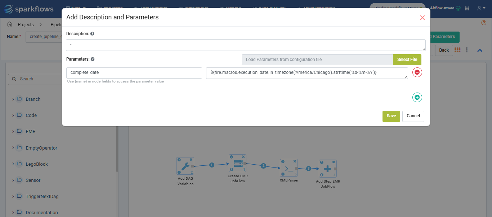
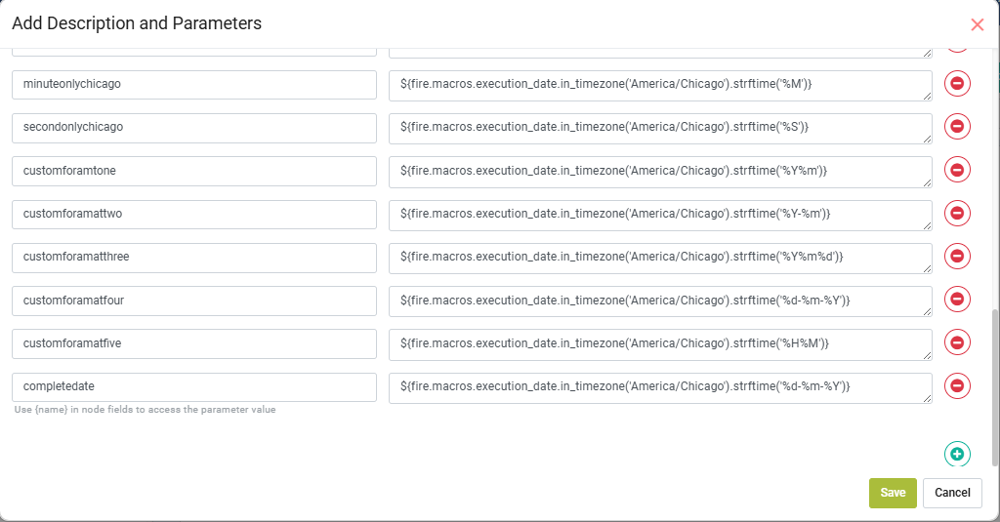
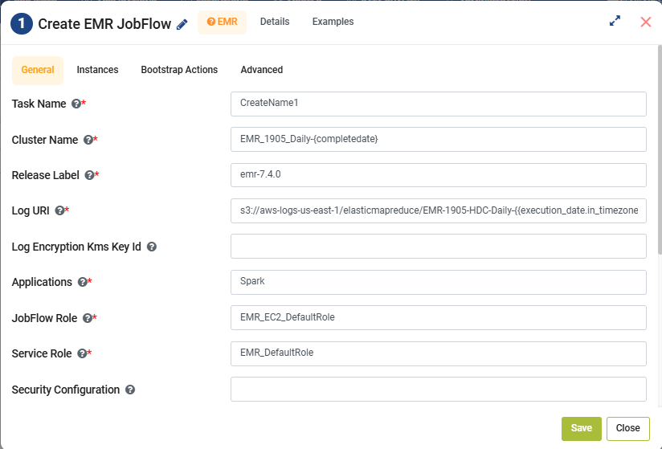
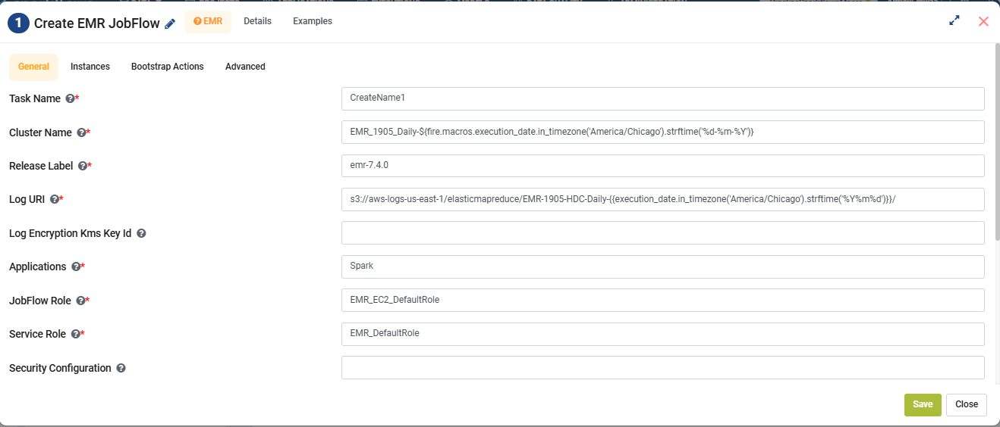

Macros in Pipelines
====

**Macros** are runtime variables that can be accessed by the Sparkflows pipelines. They can be defined in the format such as **${fire.ds}** to access **Current Date** value or they can be defined as an expression i.e. **${fire.macros.ts_add(ts, days)}** to add number of days to the **Current Timestamp** value. They are evaluated during the runtime. 

They can be used in Sparkflows nodes such as **Create EMR JobFlow**, **Add Step EMR JobFlow** & other nodes.

Some of the scenarios where they can be used are listed below:

* Adding Pipeline Executor details and Datetime Values.
* To get Date Part values at runtime.
* They can also be used as pipeline parameters.

Some of the macros that can be used in Sparkflows are listed below:

Macros that Sparkflows supports
++++++++++++++++++++++++++++++

.. list-table:: 
   :widths: 30 70
   :header-rows: 1

   * - Macro
     - Description
   * - ${fire.ds}
     - Returns the Current Execution Date as YYYY-MM-DD
   * - ${fire.ds_nodash}
     - Returns the Current Execution Date as YYYYmmDD
   * - ${fire.ts}
     - Returns the Current Execution Timestamp as YYYY-mm-DD HH-MM-SS
   * - ${fire.pl.name}
     - Returns the Current Pipeline Name, e.g. EndToEnd_Pipeline
   * - ${fire.pl.id}
     - Returns the Current Pipeline ID, e.g. 321
   * - ${fire.ple.id}
     - Returns the Current Pipeline Execution ID, e.g. 881
   * - ${fire.ple.username}
     - Returns the Username by whom the Pipeline has been executed, e.g. admin
   * - ${fire.macros.ds_add(ds, days)}
     - Returns the date, where (days as +1 or -1) ahead or behind from the current Date
   * - ${fire.macros.ds_format(ds, input_format, output_format)}
     - Takes the date in the default format and returns the date in the specified output format
   * - ${fire.macros.random()}
     - Generates and Returns a random value during the execution of a job
   * - ${fire.macros.ds_format(ds, offset_unit, output_format, offset_value)}
     - Formats a given date (ds), adjusts it by a specified number of days or months or years, and returns it in the         desired output format
   * - ${fire.macros.ts_add(ts, days)}
     - Adds or Subtracts a specified number of days to a given timestamp (ts) and returns the updated timestamp
   * - ${fire.macros.ts_format(ts, offset_unit, output_format, offset_value)}
     - Adjusts a given timestamp (ts) by a specified number of days or timeperiod and returns it in the desired format
   * - ${fire.macros.ts_format(ts, input_format, output_format)}
     - Formats a given timestamp (ts) from the specified input format to the desired output format
   * - ${fire.macros.ds_format(ds, m, yyyy-MM-01, 1)}
     - Returns the first day of the next month
   * - ${fire.macros.ds_add(${fire.macros.ds_format(ds, d, yyyy-MM-01, 0)}, -1, , yyyy-MM-dd)}
     - Returns the last day of the previous month
   * - ${fire.macros.ds_format(ds, d, yyyy-MM-01, 0)}
     - Returns the first day of the current month
   * - ${fire.macros.ds_add(${fire.macros.ds_format(ds, m, yyyy-MM-01, 2)}, -1, , yyyy-MM-dd)}
     - Returns the last day of the next month

Macros related to Date
+++++++++++++++++++++++++

.. list-table:: 
   :widths: 25 25 25 25
   :header-rows: 1

   * - Current Date
     - Operation
     - Input
     - Output
   * - 2024-11-19
     - ${fire.macros.ds_add(ds, days)}
     - 1
     - 2024-11-20
   * - 2024-11-19	
     - ${fire.macros.ds_add(ds, days)}
     - -1
     - 2024-11-18
   * - 2024-11-19	
     - ${fire.macros.ds_format(ds, offset_unit, output_format, offset_value)}
     - 2024-11-19, d,DD-mm-YYYY,0
     - 2024-11-19
   * - 2024-11-19
     - ${fire.macros.ds_format(ds, offset_unit, output_format, offset_value)}
     - 2024-11-19, m,DD-mm-YYYY,0
     - 2024-11-19
   * - 2024-11-19
     - ${fire.macros.ds_format(ds, offset_unit, output_format, offset_value)}
     - 2024-11-19, y,DD-mm-YYYY,0
     - 2024-11-19
   * - 2024-11-19
     - ${fire.macros.ds_format(ds, offset_unit, output_format, offset_value)}
     - 2024-11-19, d,DD-mm-YYYY,-1
     - 18-11-2024
   * - 2024-11-19
     - ${fire.macros.ds_format(ds, offset_unit, output_format, offset_value)}
     - 2024-11-19, m,DD-mm-YYYY,-1
     - 19-10-2024
   * - 2024-11-19
     - ${fire.macros.ds_format(ds, offset_unit, output_format, offset_value)}
     - 2024-11-19, y,DD-mm-YYYY,-1
     - 19-11-2023
   * - 2024-11-19
     - ${fire.macros.ds_format(ds, offset_unit, output_format, offset_value)}
     - 2024-11-19, d,DD-mmm-YYYY,-1
     - 18-NOV-2024
   * - 2024-11-19
     - ${fire.macros.ds_format(ds, offset_unit, output_format, offset_value)}
     - 2024-11-19, m,DD-mmm-YYYY,-1
     - 19-OCT-2024
   * - 2024-11-19
     - ${fire.macros.ds_format(ds, offset_unit, output_format, offset_value)}
     - 2024-11-19, y,DD-mmm-YYYY,-1
     - 19-NOV-2023
   * - 2024-11-19
     - ${fire.macros.ds_format(ds, offset_unit, output_format, offset_value)}
     - 2024-11-19, m,YYmm,-1
     - 2410

Macros related to Timestamp
+++++++++++++++++++++++++++++

.. list-table:: 
   :widths: 25 25 25 25
   :header-rows: 1

   * - Current Timestamp
     - Operation
     - Input
     - Output
   * - 2024-11-19 14:19:44
     - ${fire.macros.ts_format(ts, offset_unit, output_format, offset_value)}
     - 2024-11-19 14:19:44, d,YYYY-mm-DD HH-MM-SS,0
     - 2024-11-19 14:19:44
   * - 2024-11-19 14:19:44
     - ${fire.macros.ts_format(ts, offset_unit, output_format, offset_value)}
     - 2024-11-19 14:19:44, m,YYYY-mm-DD HH-MM-SS,0
     - 2024-11-19 14:19:44
   * - 2024-11-19 14:19:44
     - ${fire.macros.ts_format(ts, offset_unit, output_format, offset_value)}
     - 2024-11-19 14:19:44, y,YYYY-mm-DD HH-MM-SS,0
     - 2024-11-19 14:19:44
   * - 2024-11-19 14:19:44
     - ${fire.macros.ts_format(ts, offset_unit, output_format, offset_value)}
     - 2024-11-19 14:19:44, h,YYYY-mm-DD HH-MM-SS,0
     - 2024-11-19 14:19:44
   * - 2024-11-19 14:19:44
     - ${fire.macros.ts_format(ts, offset_unit, output_format, offset_value)}
     - 2024-11-19 14:19:44, m,YYYY-mm-DD HH-MM-SS,0
     - 2024-11-19 14:19:44
   * - 2024-11-19 14:19:44
     - ${fire.macros.ts_format(ts, offset_unit, output_format, offset_value)}
     - 2024-11-19 14:19:44, d,YYYY-mm-DD HH-MM-SS,-1
     - 2024-11-18 14:19:44
   * - 2024-11-19 14:19:44
     - ${fire.macros.ts_format(ts, offset_unit, output_format, offset_value)}
     - 2024-11-19 14:19:44, m,YYYY-mm-DD HH-MM-SS,-1
     - 2024-10-19 14:19:44
   * - 2024-11-19 14:19:44
     - ${fire.macros.ts_format(ts, offset_unit, output_format, offset_value)}
     - 2024-11-19 14:19:44, y,YYYY-mm-DD HH-MM-SS,-1
     - 2023-11-19 14:19:44
   * - 2024-11-19 14:19:44
     - ${fire.macros.ts_format(ts, offset_unit, output_format, offset_value)}
     - 2024-11-19 14:19:44, h,YYYY-mm-DD HH-MM-SS,-1
     - 2024-11-19 13:19:44
   * - 2024-11-19 14:19:44
     - ${fire.macros.ts_format(ts, offset_unit, output_format, offset_value)}
     - 2024-11-19 14:19:44, mi,YYYY-mm-DD HH-MM-SS,-1
     - 2024-11-19 14:18:44
   * - 2024-11-19 14:19:44
     - ${fire.macros.ts_format(ts, offset_unit, output_format, offset_value)}
     - 2024-11-19 14:19:44, s,YYYY-mm-DD HH-MM-SS,-1
     - 2024-11-19 14:19:43

Macros related to Time Zone
+++++++++++++++++++++++++++++

.. list-table:: 
   :widths: 25 25 50
   :header-rows: 1

   * - Macro
     - Description
     - Output
   * - ${fire.macros.tz(ts, America/Chicago, yyyy-MM-dd HH:mm:ss)}
     - Converts timestamp `ts` to `America/Chicago` timezone and formats as `yyyy-MM-dd HH:mm:ss`
     - 2025-11-06 14:30:45
   * - ${fire.macros.tz(ts, America/New_York, yyyy-MM-dd HH:mm:ss)}
     - Converts timestamp `ts` to `America/New_York` timezone and formats as `yyyy-MM-dd HH:mm:ss`
     - 2025-11-06 15:30:45
   * - ${fire.macros.tz(ds, America/Chicago, yyyy-MM-dd)}
     - Converts date string `ds` to `America/Chicago` timezone and formats as `yyyy-MM-dd`
     - 2025-11-06
   * - ${fire.macros.tz(ds, Europe/London, DD-MM-YYYY)}
     - Converts date string `ds` to `Europe/London` timezone and formats as `DD-MM-YYYY`
     - 06-11-2025
   * - ${fire.macros.execution_date.in_timezone('America/Chicago').strftime('%Y')}
     - Extracts full year from execution date
     - 2025
   * - ${fire.macros.execution_date.in_timezone('America/Chicago').strftime('%y')}
     - Extracts 2-digit year from execution date
     - 25
   * - ${fire.macros.execution_date.in_timezone('America/Chicago').strftime('%m')}
     - Extracts numeric month from execution date
     - 11
   * - ${fire.macros.execution_date.in_timezone('America/Chicago').strftime('%B')}
     - Extracts full month name from execution date
     - November
   * - ${fire.macros.execution_date.in_timezone('America/Chicago').strftime('%b')}
     - Extracts abbreviated month name from execution date
     - Nov
   * - ${fire.macros.execution_date.in_timezone('America/Chicago').strftime('%d')}
     - Extracts day of month from execution date
     - 06
   * - ${fire.macros.execution_date.in_timezone('America/Chicago').strftime('%A')}
     - Extracts full weekday name from execution date
     - Thursday
   * - ${fire.macros.execution_date.in_timezone('America/Chicago').strftime('%a')}
     - Extracts abbreviated weekday name from execution date
     - Thu
   * - ${fire.macros.execution_date.in_timezone('America/Chicago').strftime('%H')}
     - Extracts hour in 24-hour format
     - 14
   * - ${fire.macros.execution_date.in_timezone('America/Chicago').strftime('%I')}
     - Extracts hour in 12-hour format
     - 02
   * - ${fire.macros.execution_date.in_timezone('America/Chicago').strftime('%M')}
     - Extracts minute component of the time
     - 30
   * - ${fire.macros.execution_date.in_timezone('America/Chicago').strftime('%S')}
     - Extracts second component of the time
     - 45
   * - ${fire.macros.execution_date.in_timezone('America/Chicago').strftime('%Y%m')}
     - Combines year and month into a single numeric value
     - 202511
   * - ${fire.macros.execution_date.in_timezone('America/Chicago').strftime('%Y-%m')}
     - Combines year and month with a hyphen separator
     - 2025-11
   * - ${fire.macros.execution_date.in_timezone('America/Chicago').strftime('%Y%m%d')}
     - Combines year, month, and day into a continuous numeric value
     - 20251106
   * - ${fire.macros.execution_date.in_timezone('America/Chicago').strftime('%d-%m-%Y')}
     - Formats date as Day-Month-Year
     - 06-11-2025
   * - ${fire.macros.execution_date.in_timezone('America/Chicago').strftime('%H%M')}
     - Combines hour and minute into a single numeric value
     - 1430

Define Macro Parameters in the Pipeline
++++++++++++++++++++++++++++++++++++

Usage of Macro as a Parameter in the Pipeline Node
++++++++++++++++++++++++++++++++++++

Direct Macro Usage in Pipeline Nodes
++++++++++++++++++++++++++++++++++++

