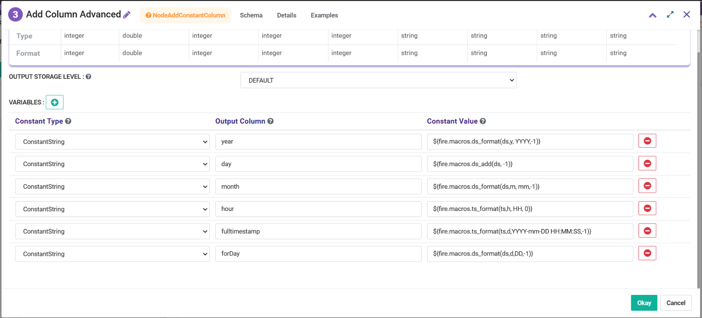
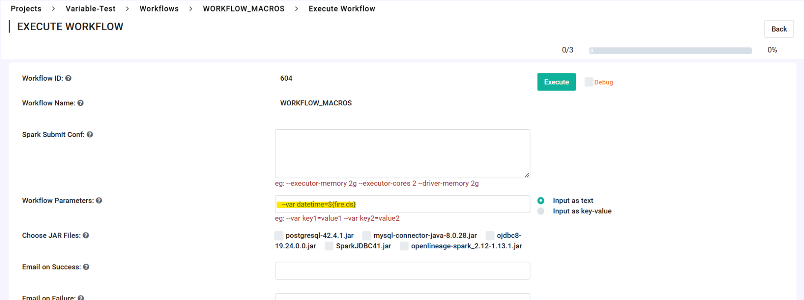

Macros in Workflows
==================

**Macros** are runtime variables that can be accessed by the Sparkflows workflows. They can be defined in the format such as ${fire.ds} to access **Current Date** value or they can defined as an expression i.e. **${fire.macros.ts_add(ts, days)}** to add number of days to the **Current Timestamp** value. They are evaluated during the runtime. 

They can be used in Sparkflows nodes such as **Add Columns**, **Read CSV** & other read nodes, **Save** Nodes, **Expression** Nodes, **Filter** Nodes and so on.

Some of the scenarios where they can be used are as below:
- Adding Workflow Executor Username, Workflow ID, Datetime Values, Pipeline Executor details
- Reading data from files created for past dates. In this scenarios files are either saved in Date-Valued folders or files have date parts. Expression ${fire.macros.ts_add(ts, days)} can be used to get past days and can be used to read specific files.
- Get Date Part values at runtime
- They can be also used as workflow parameters
- In SQL Node to filter data

Some of the macros that can be used in Sparkflows are listed below.

Macros that Sparkflows supports
++++++++++++++++++++++++++++++

.. list-table:: 
   :widths: 30 70
   :header-rows: 1

   * - Macro
     - Description
   * - ${fire.ds}
     - Returns the Current execution date as YYYY-MM-DD
   * - ${fire.ds_nodash}
     - Returns the Current execution date as YYYYmmDD
   * - ${fire.ts}
     - Returns the Current execution Timestamp as YYYY-mm-DD HH-MM-SS
   * - ${fire.wf.name}
     - Returns the Current Workflow Name, e.g. (01-Read-Macros)
   * - ${fire.wf.id}
     - Returns the Current Workflow ID, e.g. 631
   * - ${fire.wfe.id}
     - Returns the Current Workflow Execution ID, e.g. 362
   * - ${fire.wfe.username}
     - Returns the Username by whom the workflow has been executed, e.g. admin
   * - ${fire.pl.name}
     - Returns the Current Pipeline Name, e.g. EndToEnd_Pipeline
   * - ${fire.pl.id}
     - Returns the Current Pipeline ID, e.g. 321
   * - ${fire.ple.id}
     - Returns the Current Pipeline Execution ID, e.g. 881
   * - ${fire.ple.username}
     - Returns the Username by whom the Pipeline has been executed, e.g. admin
   * - ${fire.macros.ds_add(ds, days)}
     - Returns the date, where (days as +1 or -1) ahead or behind from the current Date
   * - ${fire.macros.ds_format(ds, input_format, output_format)}
     - Take the date in the default format and returns the date in the specified output format
   * - ${fire.macros.random()}
     - Generate and Returns a random value during the execution of a job
   * - ${fire.macros.ds_format(ds, days, input_format, output_format)}
     - Formats a given date (ds), adjusts it by a specified number of days, and returns it in the desired format
   * - ${fire.macros.ts_add(ts, days)}
     - Adds or Subtracts a specified number of days to a given timestamp (ts) and returns the updated timestamp
   * - ${fire.macros.ts_format(ts, days, input_format, output_format)}
     - Adjusts a given timestamp (ts) by a specified number of days and returns it in the desired format based on the provided input and output formats
   * - ${fire.macros.ts_format(ts, input_format, output_format)}
     - Formats a given timestamp (ts) from the specified input format to the desired output format

Macros related to Date
+++++++++++++++++++++++++

.. list-table:: 
   :widths: 25 25 25 25
   :header-rows: 1

   * - Current Date
     - Operation
     - Input
     - Output
   * - 2024-11-19
     - ${fire.macros.ds_add(ds, days)}
     - 1
     - 2024-11-20
   * - 2024-11-19	
     - ${fire.macros.ds_add(ds, days)}
     - -1
     - 2024-11-18
   * - 2024-11-19	
     - ${fire.macros.ds_format(ds,days, input_format, output_format)}
     - 2024-11-19, d,DD-mm-YYYY,0
     - 2024-11-19
   * - 2024-11-19
     - ${fire.macros.ds_format(ds,days, input_format, output_format)}
     - 2024-11-19, m,DD-mm-YYYY,0
     - 2024-11-19
   * - 2024-11-19
     - ${fire.macros.ds_format(ds,days, input_format, output_format)}
     - 2024-11-19, y,DD-mm-YYYY,0
     - 2024-11-19
   * - 2024-11-19
     - ${fire.macros.ds_format(ds,days, input_format, output_format)}
     - 2024-11-19, d,DD-mm-YYYY,-1
     - 18-11-2024
   * - 2024-11-19
     - ${fire.macros.ds_format(ds,days, input_format, output_format)}
     - 2024-11-19, m,DD-mm-YYYY,-1
     - 19-10-2024
   * - 2024-11-19
     - ${fire.macros.ds_format(ds,days, input_format, output_format)}
     - 2024-11-19, y,DD-mm-YYYY,-1
     - 19-11-2023
   * - 2024-11-19
     - ${fire.macros.ds_format(ds,days, input_format, output_format)}
     - 2024-11-19, d,DD-mmm-YYYY,-1
     - 18-NOV-2024
   * - 2024-11-19
     - ${fire.macros.ds_format(ds,days, input_format, output_format)}
     - 2024-11-19, m,DD-mmm-YYYY,-1
     - 19-OCT-2024
   * - 2024-11-19
     - ${fire.macros.ds_format(ds,days, input_format, output_format)}
     - 2024-11-19, y,DD-mmm-YYYY,-1
     - 19-NOV-2023

Macros related to Timestamp
+++++++++++++++++++++++++++++

.. list-table:: 
   :widths: 25 25 25 25
   :header-rows: 1

   * - Current Timestamp
     - Operation
     - Input
     - Output
   * - 2024-11-19 14:19:44
     - ${fire.macros.ts_format(ts, days, input_format, output_format)}
     - 2024-11-19 14:19:44, d,YYYY-mm-DD HH-MM-SS,0
     - 2024-11-19 14:19:44
   * - 2024-11-19 14:19:44
     - ${fire.macros.ts_format(ts, days, input_format, output_format)}
     - 2024-11-19 14:19:44, m,YYYY-mm-DD HH-MM-SS,0
     - 2024-11-19 14:19:44
   * - 2024-11-19 14:19:44
     - ${fire.macros.ts_format(ts, days, input_format, output_format)}
     - 2024-11-19 14:19:44, y,YYYY-mm-DD HH-MM-SS,0
     - 2024-11-19 14:19:44
   * - 2024-11-19 14:19:44
     - ${fire.macros.ts_format(ts, days, input_format, output_format)}
     - 2024-11-19 14:19:44, h,YYYY-mm-DD HH-MM-SS,0
     - 2024-11-19 14:19:44
   * - 2024-11-19 14:19:44
     - ${fire.macros.ts_format(ts, days, input_format, output_format)}
     - 2024-11-19 14:19:44, m,YYYY-mm-DD HH-MM-SS,0
     - 2024-11-19 14:19:44
   * - 2024-11-19 14:19:44
     - ${fire.macros.ts_format(ts, days, input_format, output_format)}
     - 2024-11-19 14:19:44, d,YYYY-mm-DD HH-MM-SS,-1
     - 2024-11-18 14:19:44
   * - 2024-11-19 14:19:44
     - ${fire.macros.ts_format(ts, days, input_format, output_format)}
     - 2024-11-19 14:19:44, m,YYYY-mm-DD HH-MM-SS,-1
     - 2024-10-19 14:19:44
   * - 2024-11-19 14:19:44
     - ${fire.macros.ts_format(ts, days, input_format, output_format)}
     - 2024-11-19 14:19:44, y,YYYY-mm-DD HH-MM-SS,-1
     - 2023-11-19 14:19:44
   * - 2024-11-19 14:19:44
     - ${fire.macros.ts_format(ts, days, input_format, output_format)}
     - 2024-11-19 14:19:44, h,YYYY-mm-DD HH-MM-SS,-1
     - 2024-11-19 13:19:44
   * - 2024-11-19 14:19:44
     - ${fire.macros.ts_format(ts, days, input_format, output_format)}
     - 2024-11-19 14:19:44, mi,YYYY-mm-DD HH-MM-SS,-1
     - 2024-11-19 14:18:44
   * - 2024-11-19 14:19:44
     - ${fire.macros.ts_format(ts, days, input_format, output_format)}
     - 2024-11-19 14:19:44, s,YYYY-mm-DD HH-MM-SS,-1
     - 2024-11-19 14:19:43
    
Usage of Macros in the Workflow Node
++++++++++++++++++++++++++++++++++++

Usage of Macros on the Workflow Execution Page
+++++++++++++++++++++++++++++++++++++++++++++

