Macros in Workflows
==================

**Macros** are runtime variables that can be accessed by the Sparkflows workflows. They can be defined in the format such as **${fire.ds}** to access **Current Date** value or they can defined as an expression i.e. **${fire.macros.ts_add(ts, days)}** to add number of days to the **Current Timestamp** value. They are evaluated during the runtime. 

They can be used in Sparkflows nodes such as **Add Columns**, **Read CSV** & other read nodes, **Save** Nodes, **Expression** Nodes, **Filter** Nodes and so on.

Some of the scenarios where they can be used are listed below:

* Adding Workflow Executor Username, Workflow ID, Datetime Values, Pipeline Executor details.
* Reading data from files created for past dates. In this scenarios files are either saved in Date-Valued folders or files have date parts. Expression **${fire.macros.ts_add(ts, days)}** can be used to get past days and can be used to read specific files.
* To get Date Part values at runtime.
* They can also be used as workflow parameters.
* To filter data in SQL Node.

Some of the macros that can be used in Sparkflows are listed below:

Macros that Sparkflows supports
++++++++++++++++++++++++++++++

.. list-table:: 
   :widths: 30 70
   :header-rows: 1

   * - Macro
     - Description
   * - ${fire.ds}
     - Returns the Current execution date as YYYY-MM-DD
   * - ${fire.ds_nodash}
     - Returns the Current execution date as YYYYmmDD
   * - ${fire.ts}
     - Returns the Current execution Timestamp as YYYY-mm-DD HH-MM-SS
   * - ${fire.wf.name}
     - Returns the Current Workflow Name, e.g. (01-Read-Macros)
   * - ${fire.wf.id}
     - Returns the Current Workflow ID, e.g. 631
   * - ${fire.wfe.id}
     - Returns the Current Workflow Execution ID, e.g. 362
   * - ${fire.wfe.username}
     - Returns the Username by whom the workflow has been executed, e.g. admin
   * - ${fire.pl.name}
     - Returns the Current Pipeline Name, e.g. EndToEnd_Pipeline
   * - ${fire.pl.id}
     - Returns the Current Pipeline ID, e.g. 321
   * - ${fire.ple.id}
     - Returns the Current Pipeline Execution ID, e.g. 881
   * - ${fire.ple.username}
     - Returns the Username by whom the Pipeline has been executed, e.g. admin
   * - ${fire.macros.ds_add(ds, days)}
     - Returns the date, where (days as +1 or -1) ahead or behind from the current Date
   * - ${fire.macros.ds_format(ds, input_format, output_format)}
     - Take the date in the default format and returns the date in the specified output format
   * - ${fire.macros.random()}
     - Generate and Returns a random value during the execution of a job
   * - ${fire.macros.ds_format(ds, days, input_format, output_format)}
     - Formats a given date (ds), adjusts it by a specified number of days, and returns it in the desired format
   * - ${fire.macros.ts_add(ts, days)}
     - Adds or Subtracts a specified number of days to a given timestamp (ts) and returns the updated timestamp
   * - ${fire.macros.ts_format(ts, days, input_format, output_format)}
     - Adjusts a given timestamp (ts) by a specified number of days and returns it in the desired format based on the provided input and output formats
   * - ${fire.macros.ts_format(ts, input_format, output_format)}
     - Formats a given timestamp (ts) from the specified input format to the desired output format

Macros related to Date
+++++++++++++++++++++++++

.. list-table:: 
   :widths: 25 25 25 25
   :header-rows: 1

   * - Current Date
     - Operation
     - Input
     - Output
   * - 2024-11-19
     - ${fire.macros.ds_add(ds, days)}
     - 1
     - 2024-11-20
   * - 2024-11-19	
     - ${fire.macros.ds_add(ds, days)}
     - -1
     - 2024-11-18
   * - 2024-11-19	
     - ${fire.macros.ds_format(ds,days, input_format, output_format)}
     - 2024-11-19, d,DD-mm-YYYY,0
     - 2024-11-19
   * - 2024-11-19
     - ${fire.macros.ds_format(ds,days, input_format, output_format)}
     - 2024-11-19, m,DD-mm-YYYY,0
     - 2024-11-19
   * - 2024-11-19
     - ${fire.macros.ds_format(ds,days, input_format, output_format)}
     - 2024-11-19, y,DD-mm-YYYY,0
     - 2024-11-19
   * - 2024-11-19
     - ${fire.macros.ds_format(ds,days, input_format, output_format)}
     - 2024-11-19, d,DD-mm-YYYY,-1
     - 18-11-2024
   * - 2024-11-19
     - ${fire.macros.ds_format(ds,days, input_format, output_format)}
     - 2024-11-19, m,DD-mm-YYYY,-1
     - 19-10-2024
   * - 2024-11-19
     - ${fire.macros.ds_format(ds,days, input_format, output_format)}
     - 2024-11-19, y,DD-mm-YYYY,-1
     - 19-11-2023
   * - 2024-11-19
     - ${fire.macros.ds_format(ds,days, input_format, output_format)}
     - 2024-11-19, d,DD-mmm-YYYY,-1
     - 18-NOV-2024
   * - 2024-11-19
     - ${fire.macros.ds_format(ds,days, input_format, output_format)}
     - 2024-11-19, m,DD-mmm-YYYY,-1
     - 19-OCT-2024
   * - 2024-11-19
     - ${fire.macros.ds_format(ds,days, input_format, output_format)}
     - 2024-11-19, y,DD-mmm-YYYY,-1
     - 19-NOV-2023

Macros related to Timestamp
+++++++++++++++++++++++++++++

.. list-table:: 
   :widths: 25 25 25 25
   :header-rows: 1

   * - Current Timestamp
     - Operation
     - Input
     - Output
   * - 2024-11-19 14:19:44
     - ${fire.macros.ts_format(ts, days, input_format, output_format)}
     - 2024-11-19 14:19:44, d,YYYY-mm-DD HH-MM-SS,0
     - 2024-11-19 14:19:44
   * - 2024-11-19 14:19:44
     - ${fire.macros.ts_format(ts, days, input_format, output_format)}
     - 2024-11-19 14:19:44, m,YYYY-mm-DD HH-MM-SS,0
     - 2024-11-19 14:19:44
   * - 2024-11-19 14:19:44
     - ${fire.macros.ts_format(ts, days, input_format, output_format)}
     - 2024-11-19 14:19:44, y,YYYY-mm-DD HH-MM-SS,0
     - 2024-11-19 14:19:44
   * - 2024-11-19 14:19:44
     - ${fire.macros.ts_format(ts, days, input_format, output_format)}
     - 2024-11-19 14:19:44, h,YYYY-mm-DD HH-MM-SS,0
     - 2024-11-19 14:19:44
   * - 2024-11-19 14:19:44
     - ${fire.macros.ts_format(ts, days, input_format, output_format)}
     - 2024-11-19 14:19:44, m,YYYY-mm-DD HH-MM-SS,0
     - 2024-11-19 14:19:44
   * - 2024-11-19 14:19:44
     - ${fire.macros.ts_format(ts, days, input_format, output_format)}
     - 2024-11-19 14:19:44, d,YYYY-mm-DD HH-MM-SS,-1
     - 2024-11-18 14:19:44
   * - 2024-11-19 14:19:44
     - ${fire.macros.ts_format(ts, days, input_format, output_format)}
     - 2024-11-19 14:19:44, m,YYYY-mm-DD HH-MM-SS,-1
     - 2024-10-19 14:19:44
   * - 2024-11-19 14:19:44
     - ${fire.macros.ts_format(ts, days, input_format, output_format)}
     - 2024-11-19 14:19:44, y,YYYY-mm-DD HH-MM-SS,-1
     - 2023-11-19 14:19:44
   * - 2024-11-19 14:19:44
     - ${fire.macros.ts_format(ts, days, input_format, output_format)}
     - 2024-11-19 14:19:44, h,YYYY-mm-DD HH-MM-SS,-1
     - 2024-11-19 13:19:44
   * - 2024-11-19 14:19:44
     - ${fire.macros.ts_format(ts, days, input_format, output_format)}
     - 2024-11-19 14:19:44, mi,YYYY-mm-DD HH-MM-SS,-1
     - 2024-11-19 14:18:44
   * - 2024-11-19 14:19:44
     - ${fire.macros.ts_format(ts, days, input_format, output_format)}
     - 2024-11-19 14:19:44, s,YYYY-mm-DD HH-MM-SS,-1
     - 2024-11-19 14:19:43
    
Usage of Macros in the Workflow Node
++++++++++++++++++++++++++++++++++++

.. figure:: ../../../_assets/user-guide/variables-macros/node.png
   :alt: macros
   :width: 60%

Usage of Macros on the Workflow Execution Page
+++++++++++++++++++++++++++++++++++++++++++++
.. figure:: ../../../_assets/user-guide/variables-macros/execution.png
   :alt: macros
   :width: 60%

Usage of Macros in Add Columns Advanced Node to fetch Current Date and Time values
+++++++++++++++++++++++++++++++++++++++++++++
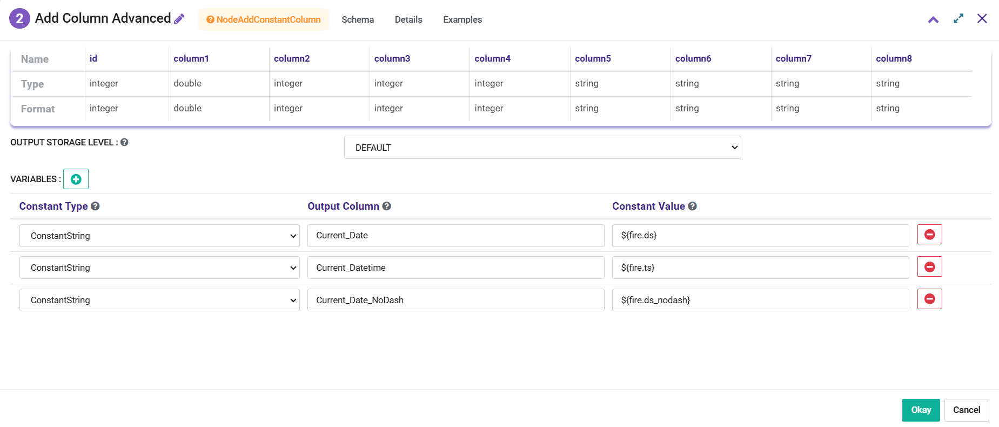

It would add new columns with Date and Time values as below:

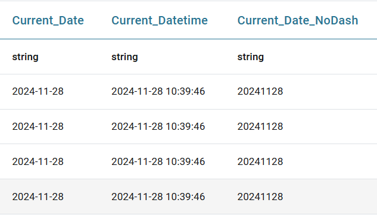

Usage of Macros to extract Date parts
+++++++++++++++++++++++++++++++++++++++++++++
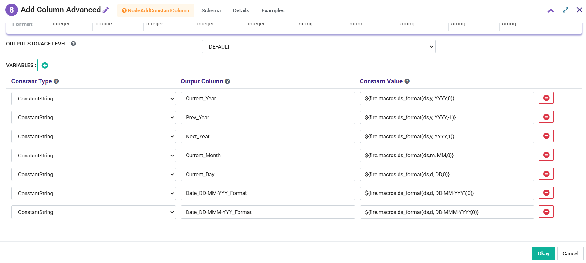

It would add new columns with Date and Time values as below:

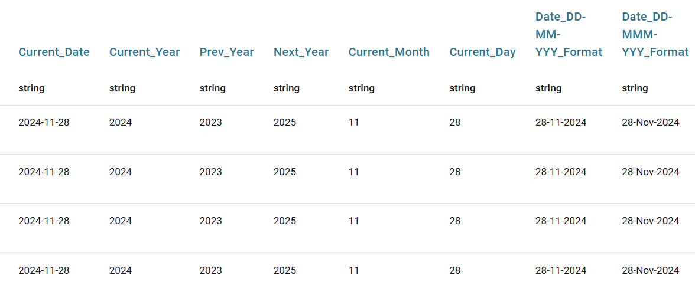

.. list-table:: 
   :widths: 50 50
   :header-rows: 1

   * - Value
     - Macro
   * - Current Year
     - ${fire.macros.ds_format(ds,y, YYYY,0)}
   * - Previous Year
     - ${fire.macros.ds_format(ds,y, YYYY,-1)}
   * - Next Year
     - ${fire.macros.ds_format(ds,y, YYYY,1)}
   * - Current Month
     - ${fire.macros.ds_format(ds,m, MM,0)}
   * - Current Day
     - ${fire.macros.ds_format(ds,d, DD,0)}
   * - Current Date in DD-MM-YYYY format
     - ${fire.macros.ds_format(ds,d, DD-MM-YYYY,0)}
   * - Current Date in DD-MMM-YYYY format
     - ${fire.macros.ds_format(ds,d, DD-MMM-YYYY,0)}

Usage of Macros to extract Time parts
+++++++++++++++++++++++++++++++++++++++++++++
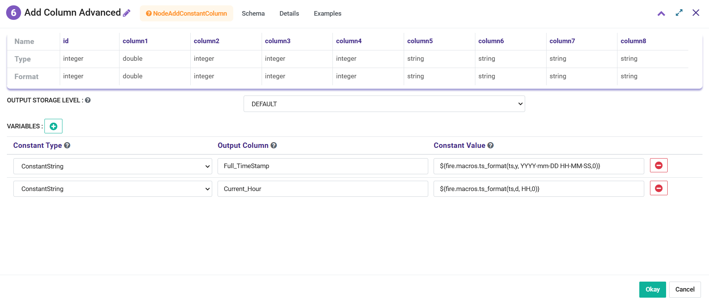

It would add new columns with Date and Time values as below:

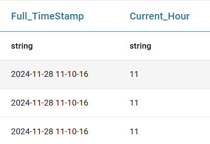

.. list-table:: 
   :widths: 50 50
   :header-rows: 1

   * - Value
     - Macro
   * - Full Timestamp
     - ${fire.macros.ts_format(ts,y, YYYY-mm-DD HH-MM-SS,0)}
   * - Current Hour
     - ${fire.macros.ts_format(ts,d, HH,0)}

Usage of Macros to add Workflow and Pipeline details to dataframe
+++++++++++++++++++++++++++++++++++++++++++++
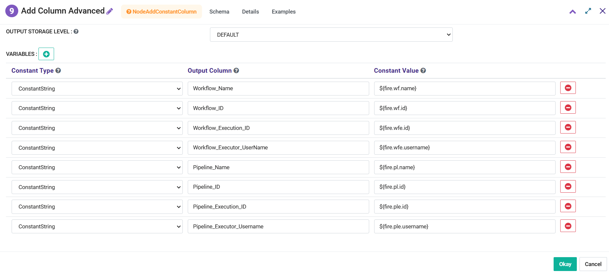

It would add new columns with Workflow values as below:

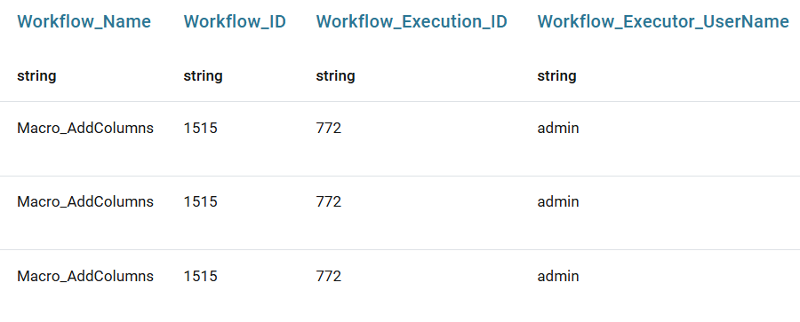

It would add new columns with Pipeline values as below. Pipeline values would be added only when workflow is triggered from a pipeline:

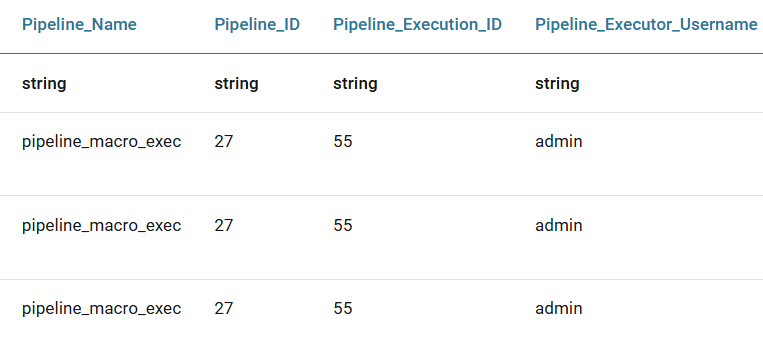

Usage of Macros in Workflow Parameter
+++++++++++++++++++++++++++++++++++++++++++++
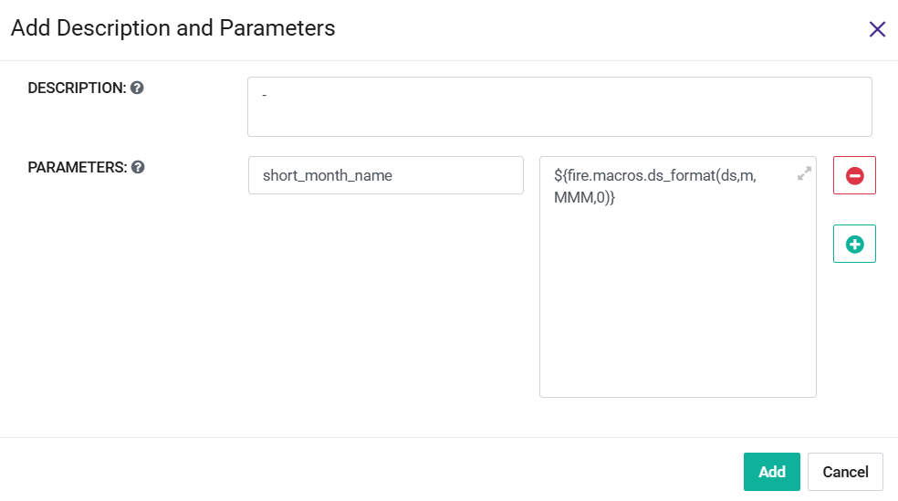

Above Parameter can be used in Add Columns Advanced node as below:

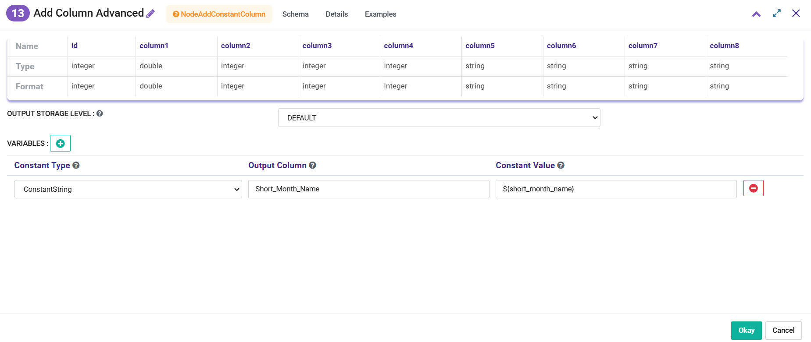

It would add new columns as below:

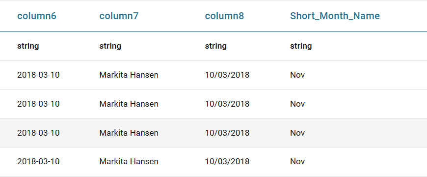

Usage of Macros in Read CSV Node to read data from Date Folders
+++++++++++++++++++++++++++++++++++++++++++++

If **Datafiles** are placed in **Date Folders** as below

.. figure:: ../../../_assets/user-guide/variables-macros/macros_addcols_node_6.png
   :alt: macros
   :width: 60%

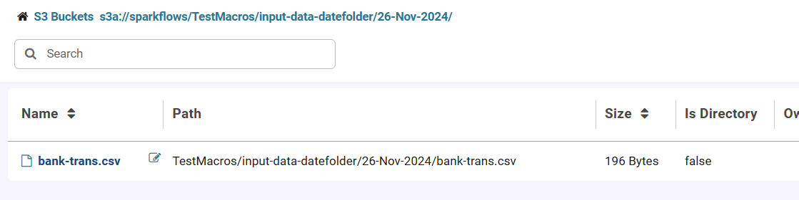

If suppose **Current Date** is **29-Nov-2024** and data needs to be read for **26-Nov-2024** then **Read CSV** Node needs to be configured as below:

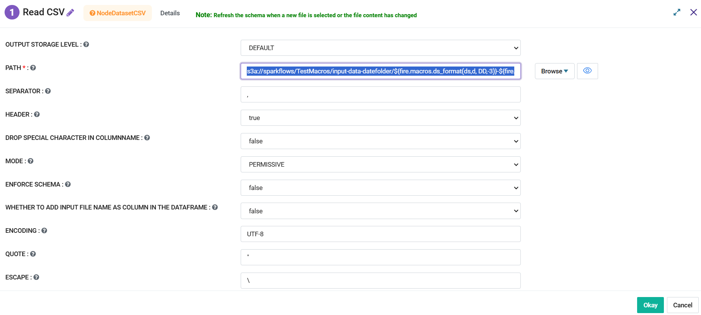

Path in the **Read CSV** needs to be set as below:

::

   s3a://sparkflows/TestMacros/input-data-datefolder/${fire.macros.ds_format(ds,d, DD,-3)}-${fire.macros.ds_format(ds,m, MMM,0)}-${fire.macros.ds_format(ds,y, YYYY,0)}/

It would fetch data from the **26-Nov-2024** folder as below:

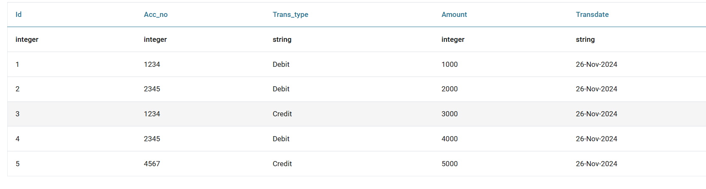

Usage of Macros in Read CSV Node to read data from Date Files
+++++++++++++++++++++++++++++++++++++++++++++

If **Datafiles** are placed in the same folder and files have **Date Part** in the name as below

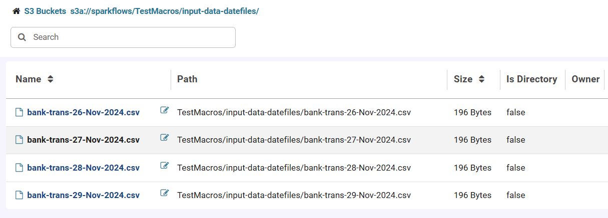

If suppose **Current Date** is **29-Nov-2024** and data needs to be read for **27-Nov-2024** then **Read CSV** Node needs to be configured as below:

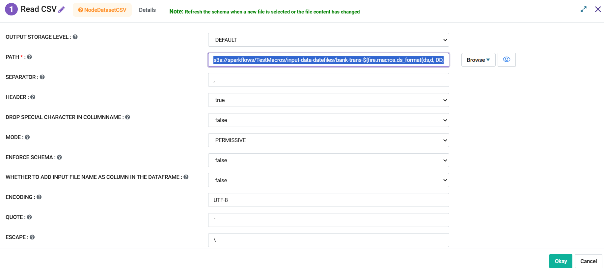

Path in the **Read CSV** needs to be set as below:

::

   s3a://sparkflows/TestMacros/input-data-datefiles/bank-trans-${fire.macros.ds_format(ds,d, DD,-2)}-${fire.macros.ds_format(ds,m, MMM,0)}-${fire.macros.ds_format(ds,y, YYYY,0)}.csv

It would fetch data from the **27-Nov-2024** file as below:

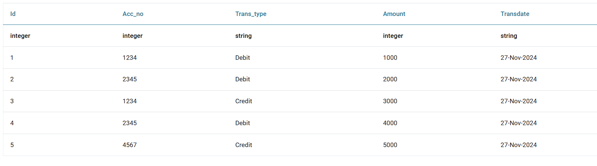

Usage of Macros in Read JDBC Node
+++++++++++++++++++++++++++++++++++++++++++++

While reading data from a **Oracle Database Table** if data needs to be read using certain condition then **Macro** can be used as below:
In this scenario we are trying to fetch employees who joined in last one year. Assuming **Current Date** is **29-Nov-2024**.

Define a **Workflow Parameter** as below:

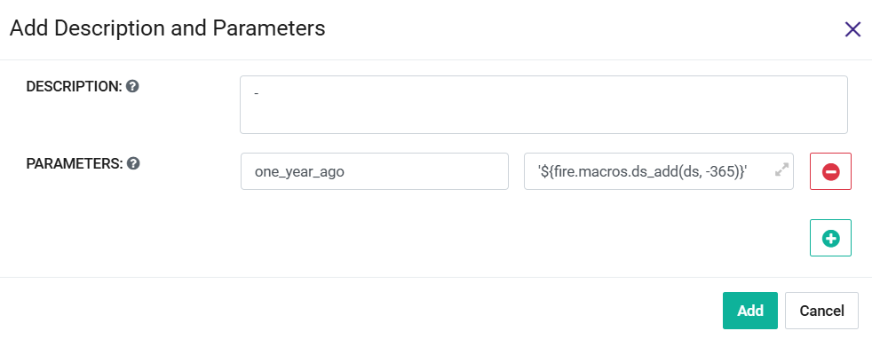

Parameter needs to be defined as below:

::

   '${fire.macros.ds_add(ds, -365)}'

**Read JDBC** Node needs to be configured as below:

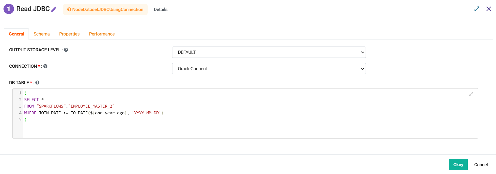

It would fetch employees who joined in last one year as below:

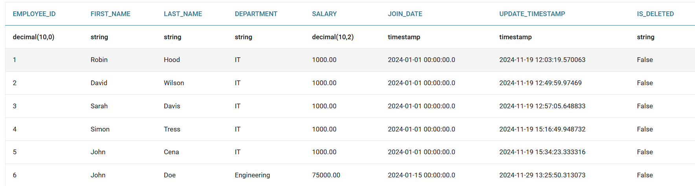

