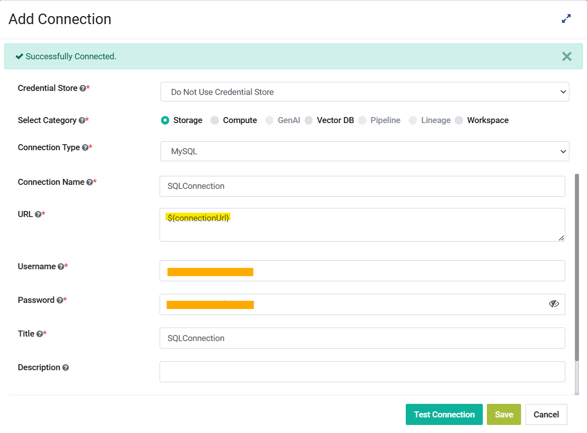

Variables in Application Connection 
==========

With Sparkflows, you can seamlessly manage dynamic variables within your Application Connection, enhancing their usage. This document demonstrates how to add dynamic variables to your Application Connection, using the example of a variable named **connectionUrl** that contains the database url for a MySQL connection.

Below are the steps:

Step 1: Add the connectionUrl variable
------------------

Navigate to Administration page then click on **Variables** card to navigate to variables list page then click on **Add Variable** button to create a Variable with the key as **connectionUrl** and add the MySQL connection URL to the value field.

Step 2: Create a MySQL Connection using the connectionUrl Variable
------------------------------
Navigate to Administration page then click on **Global/Group Connections** card to navigate to connections list page then click on **Add Connection** button to create a Connection. Select the category as Storage and the type as MySQL. Pass the value for URL as **${connectionUrl}** and fill in the rest of the details.

Step 3: Test the Connection
------------------------------

Now click on **Test Connection** button , if the value of the connectionUrl variable is correctly set as well as the rest of the detials for the connection then it will show the Successfully Connected message, which means the variable's value got correctly replaced.

Now this connection containing variables can be used seamlessly throughout Sparkflows. By following the above steps, you can incorporate dynamic variables into your application connections, enabling them to adapt to evolving conditions or input data values. This enhances the versatility and usability of your application connection.

