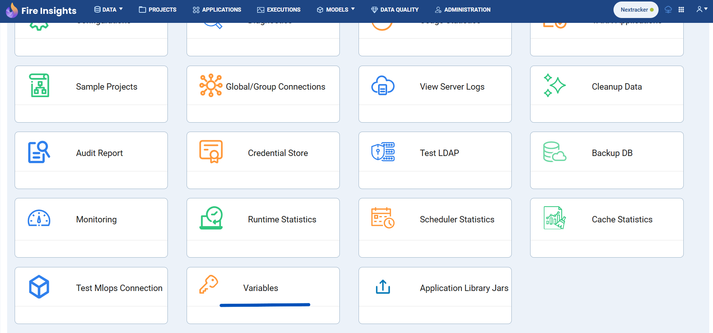

Exporting Variables to JSON file
===============
We can export **Global Variables** as well as **Group Variables** of a selected group to a **JSON** file. Global level variables are displayed on the **Administration** page within the **Variables** card.

This card is accessible only to **superusers**. The Variables card can be shown or hidden based on the configuration value **module.enableVariables**, which defaults to **false**.

.. figure:: ../../../_assets/user-guide/variables/variables_config.png
      :alt: variables_config
      :width: 65%

Here variables can be imported at both **Global** & **Group** level.

Follow the steps below to export variables:

Step 1 : Navigate to Variables Page
--------------------------------

Go to **Administration** and click on **Variables** card, as shown below.

Step 2 : Export Global Variables
--------------------------

#. From the variables page, click on the **Export** button and then click on **Export Global Variables** button from the dropdown options to export variables.

   .. figure:: ../../../_assets/user-guide/variables/export-variables/export-global-variables.png
      :alt: variables_config
      :width: 65%

#. On click of the **Export Global Variables** button a JSON file named **global_variables.json** will be downloaded, which includes variable keys and values structured in a nested hierarchy based on the dot notation in each variable key of the global variables.

#. The below image depicts the **JSON** file that gets downloaded for the set of global variables provided in the above image with the correct JSON hierarchy. So all the variables from the above image will get exported except **GroupLevKey** as it belongs to a **Group** and is not a **Global Variable**

   .. figure:: ../../../_assets/user-guide/variables/export-variables/exported-global-variables.png
      :alt: variables_config
      :width: 30%
  
   Also the above exported **JSON** file can directly be imported as variables too through the **Import** feature provided.

Step 3 : Export Variables For Group
--------------------------

#. From the variables page, click on the **Export** button and then click on **Export Variables For Group** button from the dropdown options to export variables.

   .. figure:: ../../../_assets/user-guide/variables/export-variables/export-group-variables.png
      :alt: variables_config
      :width: 65%

#. On click of the **Export Variables For Group** button a popup would appear where the **Group** whose variables are to be exported is to be selected like the image given below:

   .. figure:: ../../../_assets/user-guide/variables/export-variables/export-variables-group-selection.png
      :alt: variables_config
      :width: 65%

   In the above image we can see that only one **Group** is seen in the dropdown, since only that group has **Variables** associated/created with that group.

#. After we have selected the **Group** from the dropdown in the popup we can click on the **Export** button and a **JSON** file with the file name format as **variables_GroupId_GroupName.json** will be downloaded, which includes variable keys and values structured in a nested hierarchy based on the dot notation in each variable key for the selected group's variables.

   .. figure:: ../../../_assets/user-guide/variables/export-variables/export-variables-group-after-selection.png
      :alt: variables_config
      :width: 65%

#. The below image depicts the **JSON** file that gets downloaded for the set of the selected group’s variables that are seen in the image at the start of this step with the correct JSON hierarchy. As we can see all the variables from the image at the start of this step will get exported except **globalVarKey** as it is a **Global** variable and does not belong to the selected **Group** whose variables are being exported.

   .. figure:: ../../../_assets/user-guide/variables/export-variables/exported-group-variables.png
      :alt: variables_config
      :width: 30%
  
   Also the above exported **JSON** file can directly be imported as variables too through the **Import** feature provided.

.. Note:: The **Export Global Variables** button will be disabled in the case that when no variables exist at **Global** level. Similarly the **Export Variables For Group** button will be disabled in the case that when no variables exist for any of the groups present. In the case that no variables exist at all then the **Export** dropdown button itself will be disabled.
