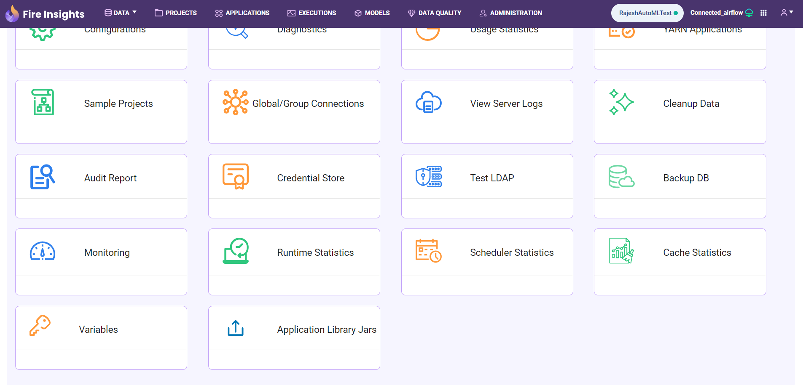

Global and Group Variables 
===============

Global level variables are displayed on the **Administration** page within the **Variables** card.

This card is accessible only to **superusers**. The Variables card can be shown or hidden based on the configuration value **module.enableVariables**, which defaults to **false**.

.. figure:: ../../../_assets/user-guide/variables/variables_config.png
      :alt: variables_config
      :width: 65%

Here variables can be defined at both **Global** & **Group** level.

These variables have the lowest precedence which means that they are used only if a corresponding variable is not defined at the project or group level.

The steps to create variables are as follows:

Step 1: Creating Variables at Global Level in Sparkflows
--------------------------------
#. Click the **Add Variable** button at the top right corner of the page. 
#. Select **Add Variable for All** from the dropdown menu.

   .. figure:: ../../../_assets/user-guide/variables/Variable_List.PNG
      :alt: variables_userguide
      :width: 65%

#. In the dialog box, enter the key, value and description for the variable, then click the  **Save** button.

   .. figure:: ../../../_assets/user-guide/variables/Add_Variable.PNG
      :alt: variables_userguide
      :width: 65%

Step 2: Creating Variables at Group Level in Sparkflows
--------------------------
#. Click the **Add Variable** button at the top right corner of the page. 
#. Select the **Add Variable for Group** from the dropdown menu.

   .. figure:: ../../../_assets/user-guide/variables/Variable_List.PNG
      :alt: variables_userguide
      :width: 65%

#. In the dialog box, enter the key, value, description and select the group from the dropdown menu, then click the **Save** button.

   .. figure:: ../../../_assets/user-guide/variables/Add_group_var.PNG
      :alt: variables_userguide
      :width: 65%

Edit Variable
-------------------------------------------
The steps to edit variables are listed below:

#. Click the **Edit** icon under the **Actions** column, next to the variable you want to modify.

   .. figure:: ../../../_assets/user-guide/variables/Variable_List.PNG
      :alt: variables_userguide
      :width: 65%

#. In the dialog box, modify the desired fields and click the **Update** button. For example, the key has been updated to **Default_var_Val**.

   .. figure:: ../../../_assets/user-guide/variables/Edit_Variable.PNG
      :alt: variables_userguide
      :width: 65%

   The image below displays the data after the variables have been updated.

   .. figure:: ../../../_assets/user-guide/variables/After_Edit_Variable.PNG
      :alt: variables_userguide
      :width: 65%

View Variable
-------------------------------------------
The steps to view variables are listed below:

#. Click the **View** icon under the **Actions** column, next to the variable you want to view.

   .. figure:: ../../../_assets/user-guide/variables/Variable_List.PNG
      :alt: variables_userguide
      :width: 65%

#. The dialog box will display all fields & their corresponding values, as shown below. 

   .. figure:: ../../../_assets/user-guide/variables/View_Variable.PNG
      :alt: variables_userguide
      :width: 65%

Delete Variable
-------------------------------------------
The steps to delete variables are listed below:

#. Click the **Delete** icon under the **Actions** column, next to the variable you want to delete.

   .. figure:: ../../../_assets/user-guide/variables/Variable_List.PNG
      :alt: variables_userguide
      :width: 65%

#. The dialog box will open with the message
   **"Are you sure you want to delete this variable? Deleting it will break any functionality or references that depend on it."**.
   Then click the **Okay** button to delete the variable.

   .. figure:: ../../../_assets/user-guide/variables/variable-delete-conf.png
      :alt: variables_userguide
      :width: 40%

   The image below displays the data after the variables have been deleted.

   .. figure:: ../../../_assets/user-guide/variables/After_Delete_Variable.PNG
      :alt: variables_userguide
      :width: 65%

Using Variable Examples
-------------------------------------------

The examples of using variables in different nodes are shown below:

#. Using variables in **Read** and **Save** nodes.

   **Global Variables** have been defined as shown below:

   .. figure:: ../../../_assets/user-guide/variables/path-variables-list.png
      :alt: variables_userguide
      :width: 65%

   These variables can be used in the **Read** node as shown below:

   .. figure:: ../../../_assets/user-guide/variables/path-variables-readcsv.png
      :alt: variables_userguide
      :width: 65%

   
#. Using and accessing variables in **other nodes**.

   In the example below, **Variable** is used in the **Row Filter** node. Similarly, it can be accessed in other nodes wherever applicable.

   .. figure:: ../../../_assets/user-guide/variables/variable-in-rowfilter.png
      :alt: variables_userguide
      :width: 65%

  

   
     

 
