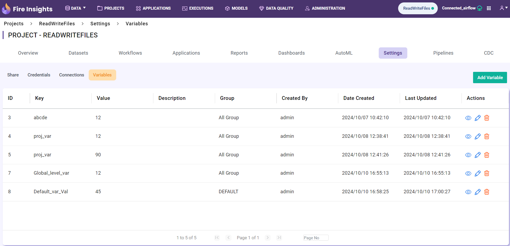
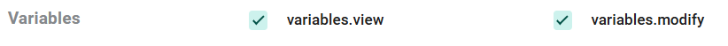

Project Level Variables 
===============

Project-level variables are located on the **Project Overview** page, within the **Settings** tab under the **Variables** section. Access to this tab is restricted to the users with **variable.modify** permission.

Also, Variables tab can be hidden or shown based on the Configuration value **module.enableVariables**, which defaults to **false**.

.. figure:: ../../../_assets/user-guide/variables/variables_config.png
      :alt: variables_config
      :width: 65%

Variables created at the project level will be shown in their respective project's overview page.

These variables have the highest priority which means the system will first check for the variable at the project level and fetch the value if available. If not, it will fall back to the group level, and then to the global level.

Variables Permission
--------------------------------
Variables permissions can be found on the **Administration** page under the **User Management** card, in the **Role** tab. Click the **Edit** icon to modify permissions.

Here user can get access for **Add Variable** - User must have **variables.add** permission, **Edit Variable** - User must have **variables.modify** permission to edit variable tab inside project and global level, **View Variable** - User must have **variables.view** permission, **Delete Variable** - User must have **variables.delete** permission, as shown below.

The steps for creating and modifying variables are as follows:

Add Variable 
--------------------------------
#. Click the **Add Variable** button located at the right corner of the page above the **Actions** column. 

   .. figure:: ../../../_assets/user-guide/variables/Project_Variable_list.PNG
      :alt: variables_userguide
      :width: 65%

#. In the dialog box, add parameters by specifying the key, value and description fields, then click the **Save** button.
   For key, the alphanumeric value can be added by including **'_'** as shown below:

   .. figure:: ../../../_assets/user-guide/variables/Add_Variable.PNG
      :alt: variables_userguide
      :width: 65%

Edit Variable
-------------------------------------------

#. Click the **Edit** icon under the **Actions** column, next to the variable you want to modify.

   .. figure:: ../../../_assets/user-guide/variables/Project_var_List.PNG
     :alt: variables_userguide
     :width: 65%

#. In the dialog box, modify the desired fields and click the **Update** button. For example, here the key is modified to **roleUserName**.

   .. figure:: ../../../_assets/user-guide/variables/Project_Edit.PNG
      :alt: variables_userguide
      :width: 65%

   The image below displays the data after the variable has been updated.

   .. figure:: ../../../_assets/user-guide/variables/Project_Edit_List.PNG
      :alt: variables_userguide
      :width: 65%

View Variable
-------------------------------------------

#. Click the **View** icon under the **Actions** column, next to the variable you want to view.

   .. figure:: ../../../_assets/user-guide/variables/Project_var_List.PNG
      :alt: variables_userguide
      :width: 65%

#. The dialog box will display all fields & their corresponding values, as shown below. 

   .. figure:: ../../../_assets/user-guide/variables/Project_View.PNG
      :alt: variables_userguide
      :width: 65%

Delete Variable
-------------------------------------------

#. Click the **Delete** icon under the **Actions** column, next to the variable you want to delete.

   .. figure:: ../../../_assets/user-guide/variables/Project_var_List.PNG
      :alt: variables_userguide
      :width: 65%

#. The dialog box will open with the confirmation message "**Are you sure you want to delete this variable? Deleting it will break any functionality or 
   references that depend on it.**". Now click the **Okay** button to delete the variable.

   .. figure:: ../../../_assets/user-guide/variables/variable-delete-conf.png
      :alt: variables_userguide
      :width: 40%

   

