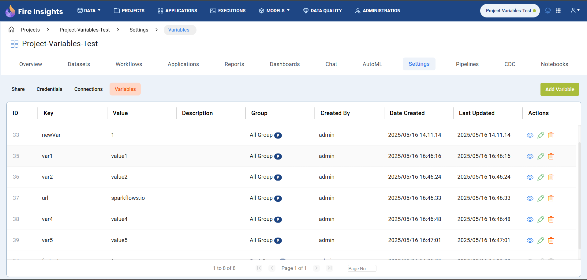

Project Level Variables 
===============

Project-level variables are located on the **Project Overview** page, within the **Settings** tab under the **Variables** section. Any user who is having the permission of **variables.view** or **variables.modify** will have access to the **Variables** tab at project level.

Also, Variables tab can be hidden or shown based on the Configuration value **module.enableVariables**, which defaults to **false**.

.. figure:: ../../../_assets/user-guide/variables/variables_config.png
      :alt: variables_config
      :width: 65%

Variables created at the project level will be shown in their respective project's overview page.

.. Note:: These variables have the highest priority which means the system will first check for the variable at the project level and fetch the value if available. If not, it will fall back to the group level, and then to the global level.

Variables Permission
--------------------------------
Variables permissions can be found on the **Administration** page under the **User Management** card, in the **Role** tab. Click the **Edit** icon to modify permissions or a new Role can be added with the required permissions if needed.

Users can be granted the **variables.view** permission, which allows them to access the Variables tab at the project level and view the project's variables. The **variables.modify** permission provides additional capabilities through which users can access the Variables tab at the project level, view variables, edit variables, and delete variables at project level. If a user does not have either **variables.view** or **variables.modify** permission, then the Variables tab will not be accessible at project level to that user.

.. figure:: ../../../_assets/user-guide/variables/Variable_permission.PNG
   :alt: variables_userguide
   :width: 65%

The steps for creating and modifying variables are as follows:

Add Variable 
--------------------------------
#. Click the **Add Variable** button located at the right corner of the page above the **Actions** column.

   .. figure:: ../../../_assets/user-guide/variables/Project_Add_Variable.PNG
      :alt: variables_userguide
      :width: 65%

#. In the dialog box, add parameters by specifying the key, value and description fields, then click the **Save** button.
   For key, the alphanumeric value can be added including underscore **'_'** too as shown below:

   .. figure:: ../../../_assets/user-guide/variables/Project_Add_Variable_Key_Value.PNG
      :alt: variables_userguide
      :width: 65%

Edit Variable
-------------------------------------------

#. Click the **Edit** icon in the **Actions** column, for the variable that the user wants to modify.

   .. figure:: ../../../_assets/user-guide/variables/Project_Edit_Variable.PNG
     :alt: variables_userguide
     :width: 65%

#. In the dialog box, modify the desired fields and click the **Update** button. For example, here the key is modified to **newVarKey**.

   .. figure:: ../../../_assets/user-guide/variables/Project_Variable_Edit_Key_Value.PNG
      :alt: variables_userguide
      :width: 65%

   The image below displays the data after the variable has been updated.

   .. figure:: ../../../_assets/user-guide/variables/Project_After_Edit_Variable.PNG
      :alt: variables_userguide
      :width: 65%

View Variable
-------------------------------------------

#. Click the **View** icon in the **Actions** column, for the variable that the user wants to view.

   .. figure:: ../../../_assets/user-guide/variables/Project_View_Variable.PNG
      :alt: variables_userguide
      :width: 65%

#. The dialog box will display all fields & their corresponding values, as shown below. 

   .. figure:: ../../../_assets/user-guide/variables/Project_View_Variable_Key_Value.PNG
      :alt: variables_userguide
      :width: 65%

Delete Variable
-------------------------------------------

#. Click the **Delete** icon in the **Actions** column, for the variable that the user wants to delete.

   .. figure:: ../../../_assets/user-guide/variables/Project_Delete_Variable.PNG
      :alt: variables_userguide
      :width: 65%

#. The dialog box will open with the confirmation message "**Are you sure you want to delete this variable? Deleting it will break any functionality or 
   references that depend on it.**". Now click the **Okay** button to delete the variable.

   .. figure:: ../../../_assets/user-guide/variables/Project_Delete_Variable_Msg.PNG
      :alt: variables_userguide
      :width: 40%
