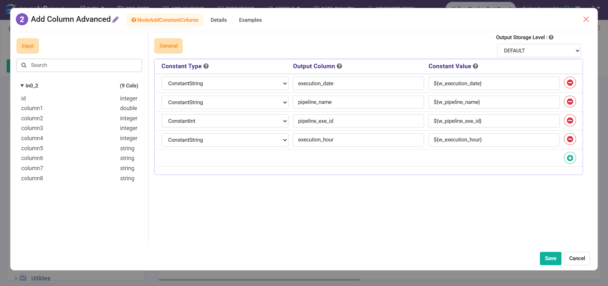
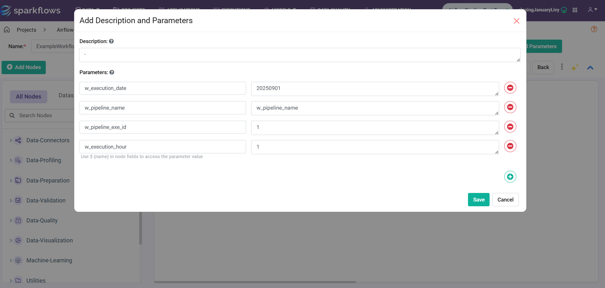
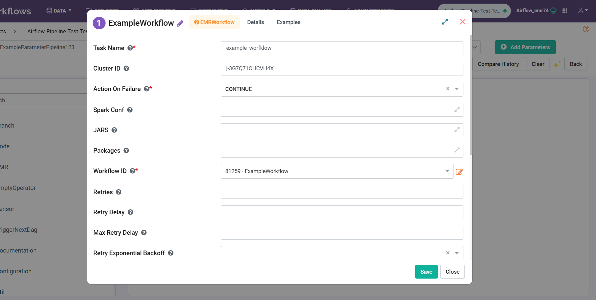
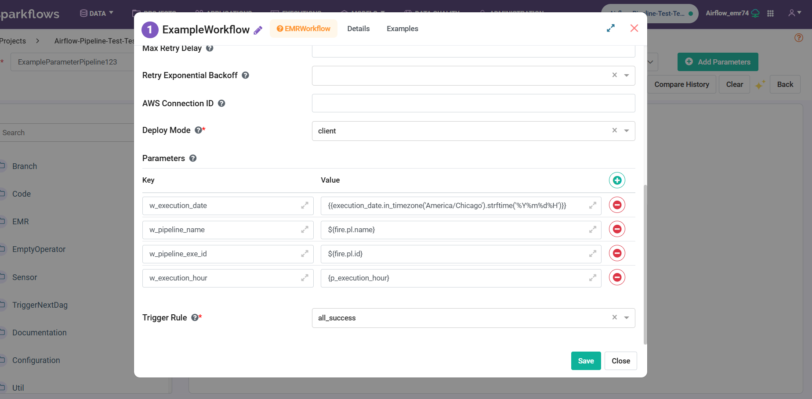
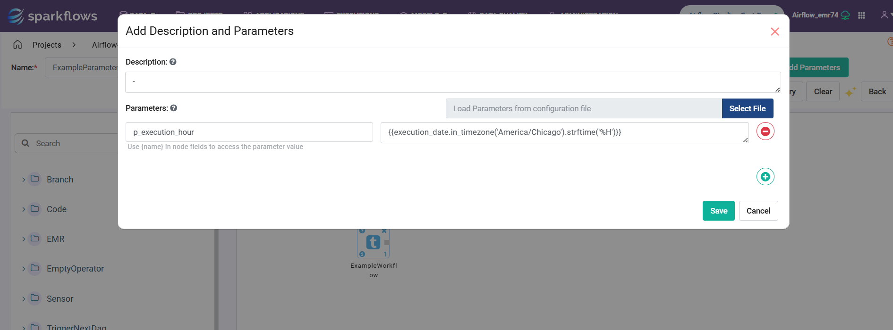

Variables in Workflows and Pipelines
====

This document provides the example of passing the different dynamic values from the pipeline to workflows.

Workflow
----

In workflow, the *Add Column Advanced* node is parameterised. **${PARAMETER_NAME}** is used to get the value in workflow nodes.

The workflow is parameterized with the following fields:

Pipeline
----

Attach the above workflow as a step to EMR using the **EMRWorkflow node** with parameters.

EMRWorkflow Node in Pipeline:
++++

**Parameters in EMRWorkflow Node:** The values from the pipeline are passed to the workflow via the Parameters field in the EMRWorkflow pipeline node.

In the above:
  
* For **w_execution_date**, airflow macros value is passed: 

  {{execution_date.in_timezone('America/Chicago').strftime('%Y%m%d%H')}}

* For **w_pipeline_name** and **w_pipeline_exec_id**, Sparkflows macros passed with ${fire.pl.name} and ${fire.pl.id}

* For **w_execution_hour**, pipeline parameter is passed with {p_execution_hour}

Pipeline parameters:
++++

In pipeline parameters with name: **p_execution_hour and value is airflow macros**:

{{execution_date.in_timezone('America/Chicago').strftime('%H')}}

.. Note:: The above value can also be passed directly in the *Parameters* field of the EMRWorkflow pipeline node.

