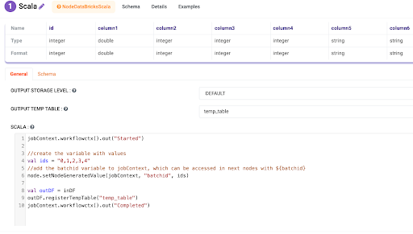
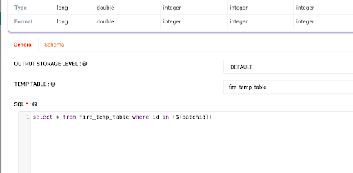

Node 
==========

With Sparkflows, you can seamlessly manage dynamic variables within your data processing workflows, enhancing their adaptability and efficiency. This document demonstrates how to add dynamic variables to your workflow in one node and access their values in subsequent nodes, using the example of a variable named **batchid**.

Below are the steps:

Step 1: Adding Dynamic Variables in Scala Node
------------------
In the Scala Node, define the dynamic variable and its corresponding values using the following syntax: 
::

  //create the variable with values 
  val ids = "0,1,2,3,4"
 //add the batchid variable to jobContext, which can be accessed in the next nodes with ${batchid}
 node.setNodeGeneratedValue(jobContext, "batchid", ids)

Above snippet creates the **batchid** variable with the values specified in the variable ids. The **setNodeGeneratedValue** method adds this variable to the jobContext, making it accessible in subsequent nodes.

Step 2: Accessing Dynamic Variable in Subsequent Nodes
------------------------------
In the subsequent nodes, such as **SQL or ExecuteRedShiftStmt** nodes, you can access the value of **batchid** using the **${batchid}** notation. For example, in SQL nodes, you can incorporate ${batchid} directly into your SQL queries to utilize its value.

