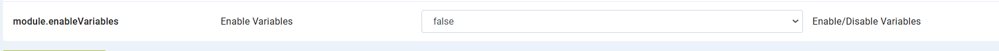

Project Level Variables 
===============

Project-level variables are displayed under the **Project Overview** page, within the **Settings** tab under the Variable section. Only users with **variable.modify** permission can access this tab.
Also, variables tab can be hide/show depending upon value given in configuration `module.enableVariables`, whose defualt value is false.

Variables created at the project level will be shown in their respective project's overview page.

These variables have the highest priority, meaning it will first check for the variable at the project level. If it is available, the value will be fetched from here. If not, it will fall back to the group then global level.

Variables Permission
--------------------------------
Variables permissions can be found on the **Administration** page, under the **User Management** card in the **Role** tab and Click on **edit icon**.
Here user can get access for 
Add Variable - User must have **variables.modify** permission
Edit Variable - User must have **variables.modify** permission to edit variable tab inside project and global level
View Variable - User must have **variables.view** permission
Delete Variable - User must have **variables.modify** permission

 .. figure:: ../../_assets/user-guide/variables/Variable_permission.PNG
      :alt: variables_userguide
      :width: 65%

Below are the steps for creating variables:

Add Variable 
--------------------------------
#. Click the **Add Variable** button located at the top right corner of the page.

   .. figure:: ../../_assets/user-guide/variables/Project_Variable_list.PNG
      :alt: variables_userguide
      :width: 65%

#. In the dialog box, add parameters by key, value  and description and click on **save** button :
   For Key alphanumeric value can be added including '_'

  .. figure:: ../../_assets/user-guide/variables/Add_Variable.PNG
        :alt: variables_userguide
        :width: 65%

Edit Variable
-------------------------------------------

#. Click the **edit icon** displayed in front of the variable you want to modify

   .. figure:: ../../_assets/user-guide/variables/Project_var_List.PNG
     :alt: variables_userguide
     :width: 65%

#. In the dialog box, modify the field and click on **update** button
    Here modified the key as **roleUserName**

   .. figure:: ../../_assets/user-guide/variables/Project_Edit.PNG
     :alt: variables_userguide
     :width: 65%

   *The image below shows data after updating the variable:

    .. figure:: ../../_assets/user-guide/variables/Project_Edit_List.PNG
      :alt: variables_userguide
      :width: 65%

View Variable
-------------------------------------------

#. Click the **view icon** displayed in front of the variable you want to view

   .. figure:: ../../_assets/user-guide/variables/Project_var_List.PNG
     :alt: variables_userguide
     :width: 65%

#. In the dialog box, it will display all fields & their value 

   .. figure:: ../../_assets/user-guide/variables/Project_View.PNG
     :alt: variables_userguide
     :width: 65%

Delete Variable
-------------------------------------------

#. Click the **delete icon** displayed in front of the variable you want to delete

   .. figure:: ../../_assets/user-guide/variables/Project_var_List.PNG
     :alt: variables_userguide
     :width: 65%

#. In the dialog box will open with message
   **Are you sure you want to delete this variable? Deleting it will break any functionality or references that depend on it**
   and click on Ok button to delete the variable

   .. figure:: ../../_assets/user-guide/variables/View_Variable.PNG
     :alt: variables_userguide
     :width: 65%

