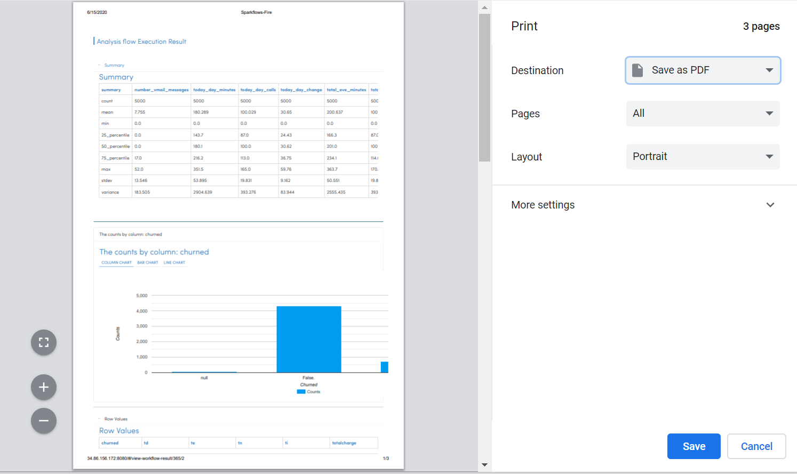

Exporting Visuals
=======================

Fire Insights enables you to export the output, dashboards and visuals in various ways.

Exporting as PDF using Browser Print Capabilities
---------------------------------------

Since Fire Insights is Browser based end to end, its easy to export the pages as PDF files using the Browser Capabilities.

- Go to File/Print
- It opens up the Print Dialog
- Select the option to save as PDF

It will save the visualization in our local system  

   
   
 
