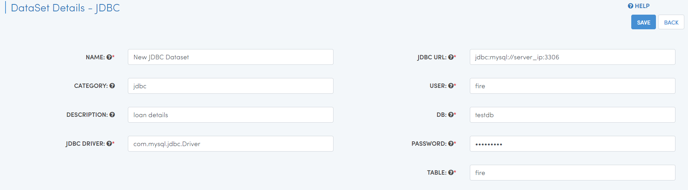
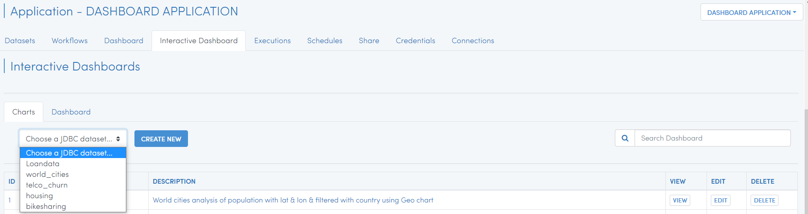
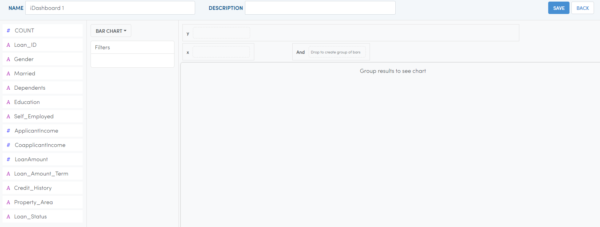
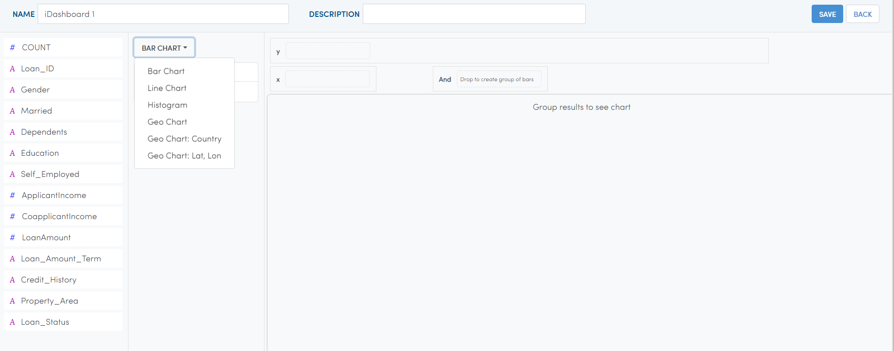
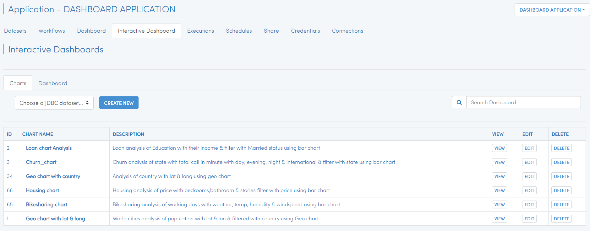
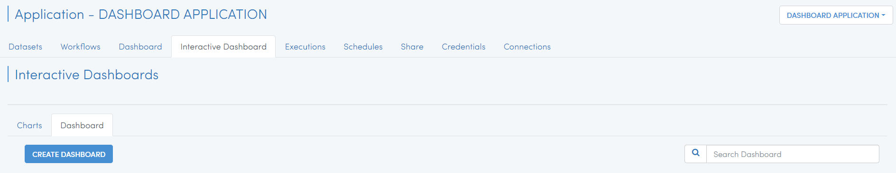
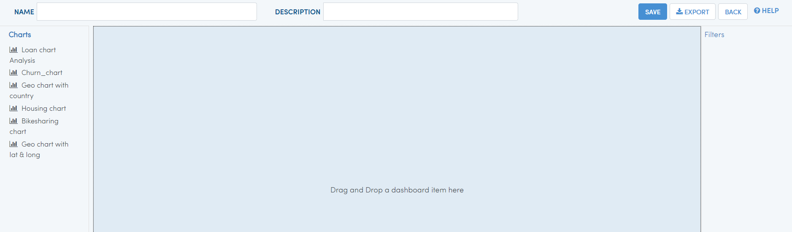
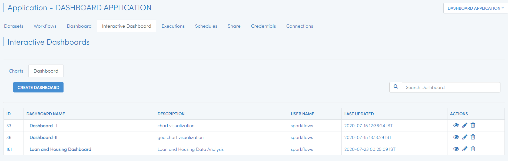

Interactive Dashboard
=======================

Fire allows you to create interactive Dashboard.

Fire allows us to create New Dataset using JDBC data type from MYSQL DB & use datasets in creating charts & dashboard.

Creating I-Dashboard
--------------------

- For creating I-Dashboard, Create JDBC datasets if not available.

You can define a New Dataset by clicking on the ``Create Dataset`` button in the Dataset page.

It will bring up the dialog box below. Select the format of the file for which the new Dataset is being created.

.. figure:: ../../_assets/tutorials/dataset/jdbc_dataset.PNG
   :alt: Dataset
   :align: center
   :width: 60%

Entering Field Details
^^^^^^^^^^^^^^^^^^^^

Below are the details of the fields in the ``Create Dataset`` page:

- **NAME** : Name of the New Dataset we are creating.
- **DESCRIPTION** : Description of the New Dataset.
- **CATEGORY** : category of the New Dataset.
- **JDBC DRIVER** : Enter JDBC DRIVER.
- **JDBC URL** : Enter JDBC URL for MYSQL DB.
- **USER** : username for MYSQL DB.
- **PASSWORD** : password for MYSQL DB.
- **DB** : Database for MYSQL DB.
- **TABLE** : Table for MYSQL.

Updating the Schema of the Dataset
^^^^^^^^^^^^^^^^^^^^

You can update the Schema of the Dataset by clicking on ``Update Sample Data/Schema``. It would display sample data for the dataset followed by the Schema inferred by Fire Insights.

You can update the column names in the schema based on your data.
 
 .. figure:: ../../_assets/tutorials/dataset/update_sampledata.PNG
   :alt: Dataset
   :align: center
   :width: 60%

Saving the New Dataset
^^^^^^^^^^^^^^^^^^^^

Click on the ``Save`` button to save the New Dataset created.

Interactive Dashboard
^^^^^^^^^^^^^^^^^^^^^^

Click on ``Interactive Dashboard`` tab in the same application where you have created JDBC Dataset.

 .. figure:: ../../_assets/tutorials/dataset/i-dashboard-tab.PNG
   :alt: Dataset
   :align: center
   :width: 60%

Click on ``chart`` tab & select Choose a JDBC dataset, there you will find all JDBC datasets created under your application.

Select any JDBC dataset for which you want to create ``chart`` & select ``CREATE NEW``

It will take you to new page, as below

Select the ``chart type``, you want to see chart

Selected ``Bar chart`` & updated column for x & y axis and add some filter

Add NAME, DESCRIPTION & save it

.. figure:: ../../_assets/tutorials/dataset/chart_filter.PNG
   :alt: Dataset
   :align: center
   :width: 60%

Once you save it, the chart will appear in chart list page

Similarly you can create different chart using specified chart type

Now using existing chart, you can create new dashboard 

Select ``Dashboard`` tab & Click on CREATE DASHBOARD

it will take us to New Dashboard page

Using drag & drop you need to add chart in canvas, Add NAME, DESCRIPTION & SAVE it.

.. figure:: ../../_assets/tutorials/dataset/save-dashboard.PNG
   :alt: Dataset
   :align: center
   :width: 60%

Once the Dashboard got saved successfully, it will show in dashboard list page from where you can view, edit & delete it.

