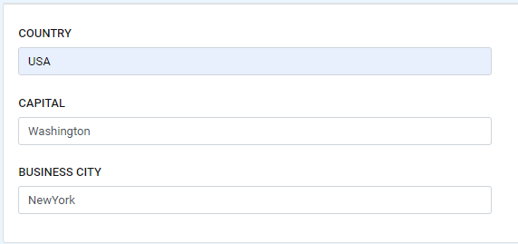

Advance Parameters Design
======================

In the Parameters stage, components  can be added by choosing ``select text-field, select boxes, buttons, etc.``. These elements also have options to add condition and logic.

      
Conditional
--------------

``Conditional`` is mostly used to show and hide components based on rules. There are two ways to apply conditional namely, simple and advance.

- For Simple conditions, the user needs to choose from the given or available options. 

  .. figure:: ../../../_assets/web-app/ConditionSimple.PNG
      :alt: web-app
      :width: 90%
      
- For Advance conditions, the user needs to enter custom javascript code. The user must assign the variable names ``show`` to a boolean result.

  .. figure:: ../../../_assets/web-app/ConditionAdvance.PNG
      :alt: web-app
      :width: 80%
      
Logic
--------------

Logic is the combination of trigger and action. The user can add multiple logic for the same component.

For example: 

- In Simple trigger, the user needs to choose from the given or available options. 

  .. figure:: ../../../_assets/web-app/LogicSimple1.PNG
      :alt: web-app
      :width: 90%
      
- For Javascript trigger the user needs to enter custom javascript code. The code will return a ``result`` variable.

  .. figure:: ../../../_assets/web-app/LogicJavascript.PNG
      :alt: web-app
      :width: 80%
      
- Every logic has at least one action. Action will return a ``value`` variable.

  .. figure:: ../../../_assets/web-app/LogicSimple2.PNG
      :alt: web-app
      :width: 80%
      
      
      
