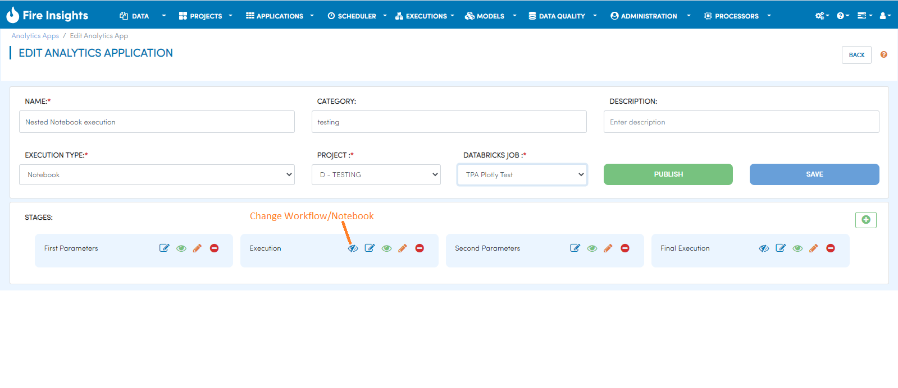
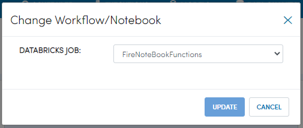
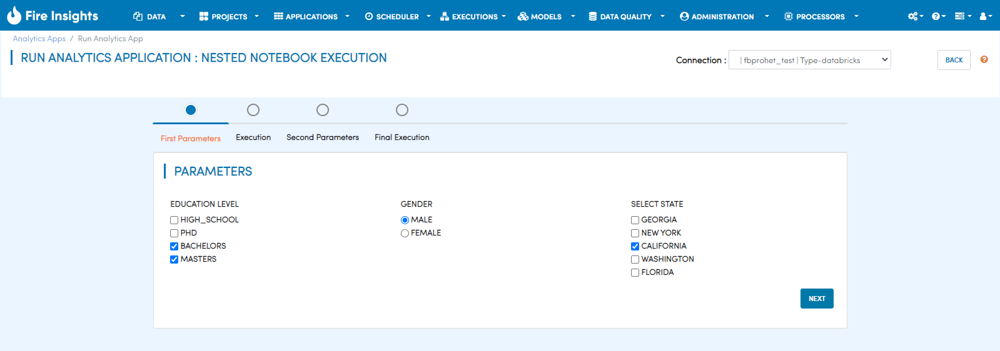
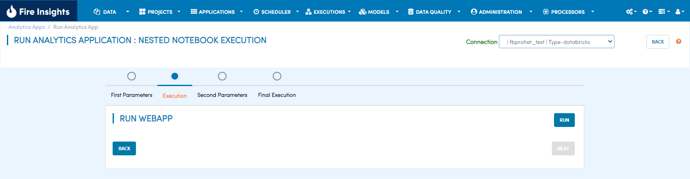
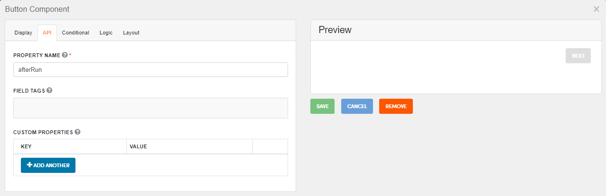
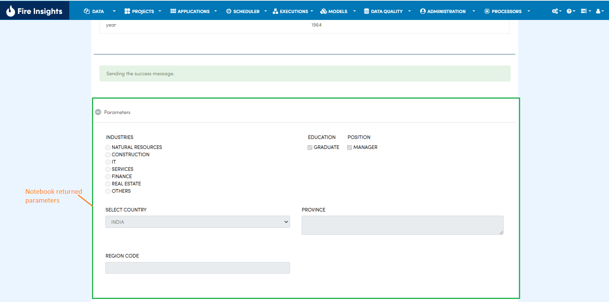
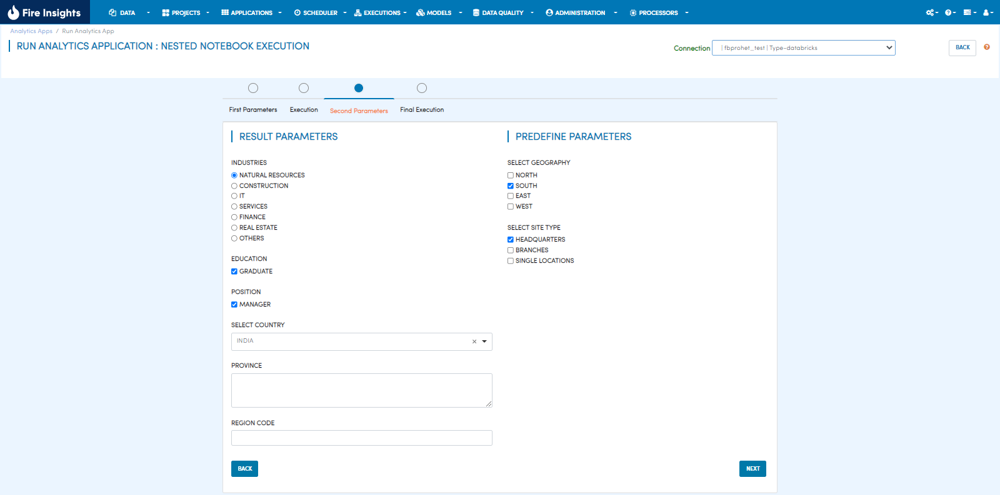
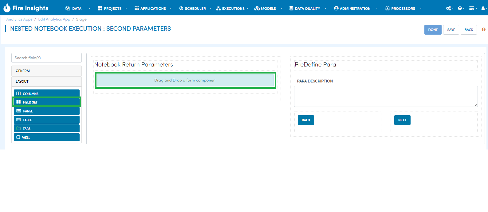
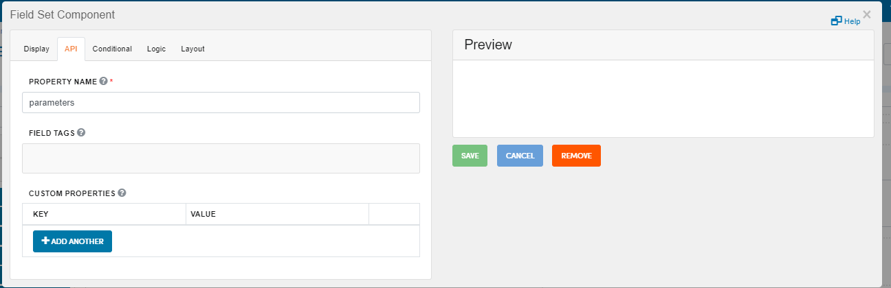
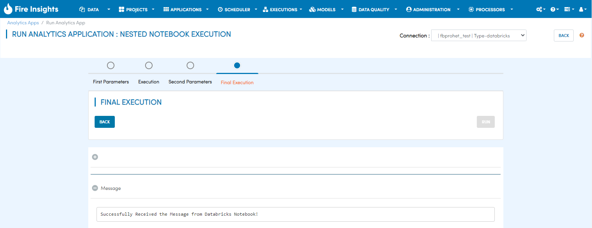

Nested Notebooks Execution
=======================

Overview
--------

In the Analytics App there are various stages. There can be multiple Run stages. Each Run stage can be executing a different or the same Notebook.

Also, the output of the execution of one Notebook, can go as input to the next Notebook execution.

Steps
-----

Users can set workflow/Notebook at stage label. The run stage has the option to set workflow or notebook. Users can choose a specific workflow or notebook here for execution.

On Clicking on Change Workflow/Notebook icon, a popup dialog will appear. Users can select workflow/notebook for current stage execution.

When users run Analytics App, they will land on the first stage.

The next stage is the first run stage

There is a change in the next button on the run stage. Its API property name should be **afterRun**. Also in the Display tab, set it to ``disabled``.

When the workflow or the notebook is executed, it may output some parameters. These parameters get displayed in the Execution page. In this page they are disabled and the users can only view them.

After clicking on the Next button, the user will go to the second parameters stage. The result parameters would get displayed here. Users can updated the values for the parameters.

In order to capture the result parameters there is a fieldset in the page/stage.

The name of the Fieldset property should be **parameters**.

The next stage is final execution. Users would click Run to execute this stage. The result parameters would also be passed as inputs to notebook/workflow execution.

      
      
.. note::  

   1. The Fieldset for displaying the parameters to the user can be in a separate Parameters Stage, or it can also be in the next Run Stage.
   2. The Fieldset has to be in the page immediately after the first Run Stage.
   3. There can be any number of Run Stages.
   
   
   
   
   
   

      
