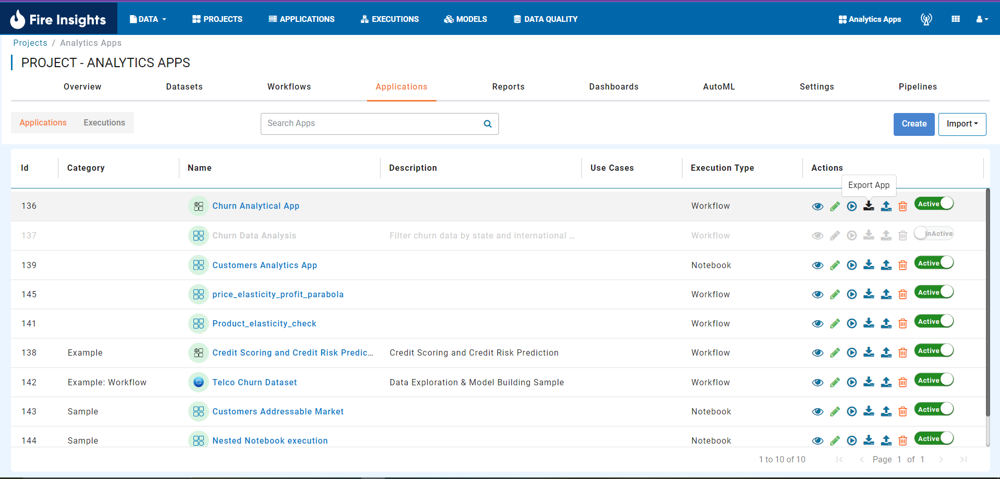
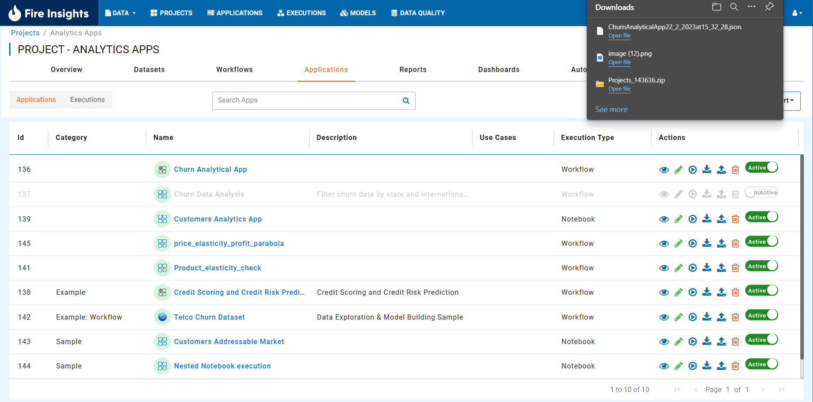
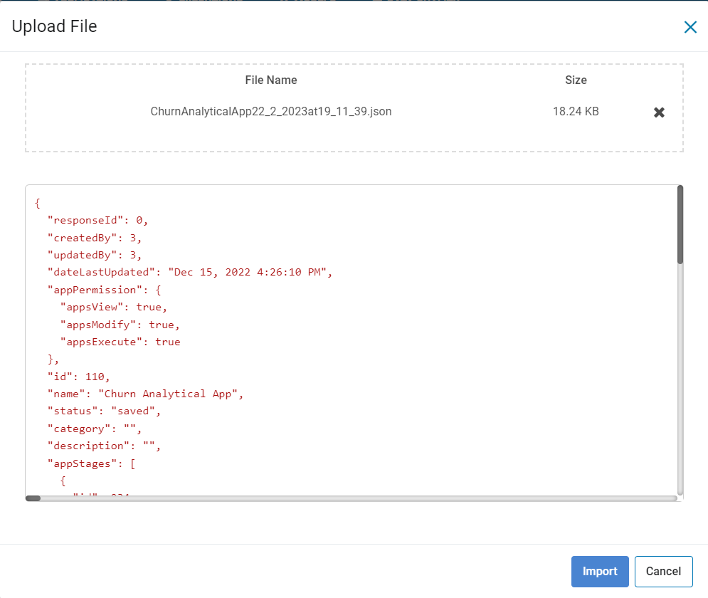
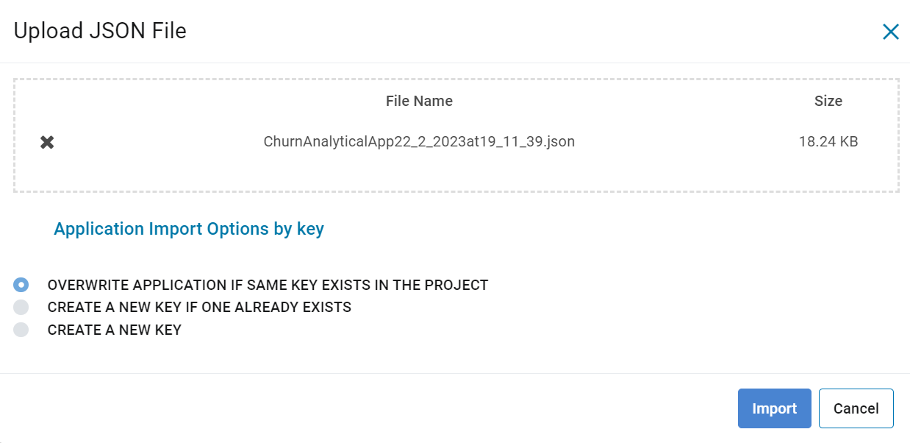
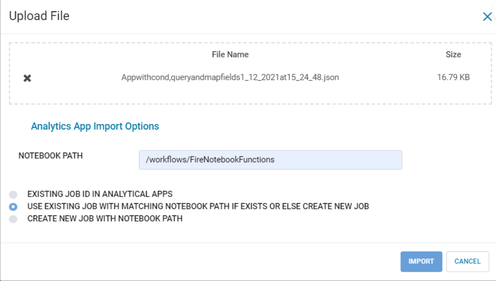
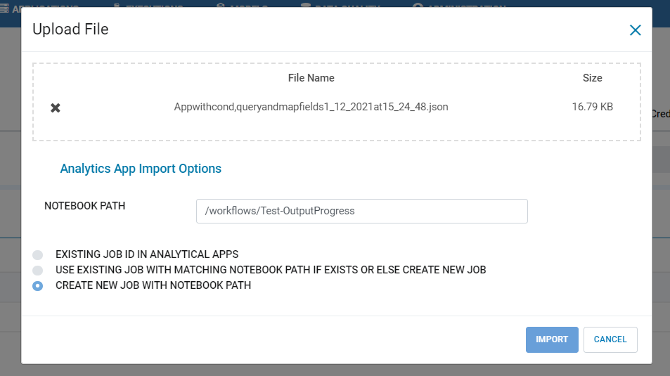

Export and Import Analytics Apps
=======================

Overview
--------

Fire enables you to export your Analytics App and download them to your computer.

It then also enables you to import your Analytics App back into any instance of Fire.

This is useful when you need to move/copy your Analytics App from one environment to another.

Exporting Analytics App
--------

Fire allows you to export Analytics App and download them to your computer.

Below are the steps for exporting Analytics App in Fire.

* Go to the Analytics Apps Page.

* Then click on the Export button.

     
* Fire will now export Analytics Application and download them to your computer as JSON file.

     
Importing Analytics App
--------

Fire allows you to import Analytics Application. Below are the steps for importing Analytics Application in Fire.

* Go to the Analytics Apps Page

  - Click on the Import button. 
  - It has 2 dropdown option i.e. Import and Import into databricks.
  

.. figure:: ../../_assets/web-app/IMPORT_APP1.png
  :alt: web-app
  :width: 70%
      
  - IMPORT : 
             - Here, you can only import JSON file without selecting any import options.
             - Choose the JSON file from your computer to Import from. You must have downloaded this JSON file from Fire during the export process.
  

      
  - IMPORT INTO DATABRICKS : 
                             - Here, you can only import json file by selecting any import options.
                             - Choose the JSON file from your computer to Import from. You must have downloaded this JSON file from Fire during the export process.
                             - Select any one option which you want to. 

There are three options when importing Analytics App:

* EXISTING JOB ID IN ANALYTICAL APPS

   -  Analytic App is imported with existing jobId present in exported JSON file.
   

* USE EXISTING JOB WITH MATCHING NOTEBOOK PATH IF EXISTS OR ELSE CREATE NEW JOB

   -  In this condition user can enter notebook path in the input box or else it will check from exported json file whether databricks job is present or not. If matching job is present that Job is used else new job is created with that notebook path using current connection.
  

* CREATE NEW JOB WITH NOTEBOOK PATH

   -  In this condition user can enter notebook path in the input box or else it will take notebook path from exported file to create new databricks job using current connection.

