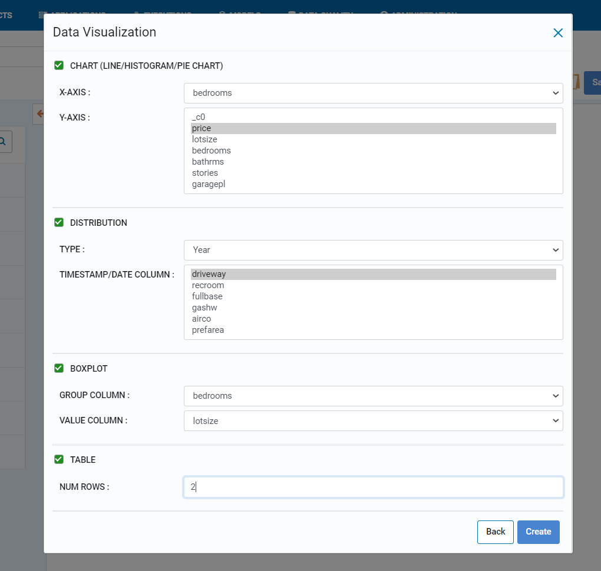
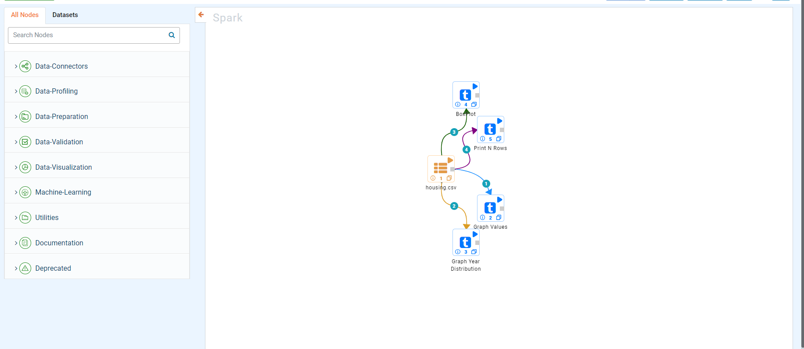
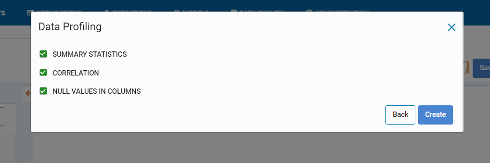
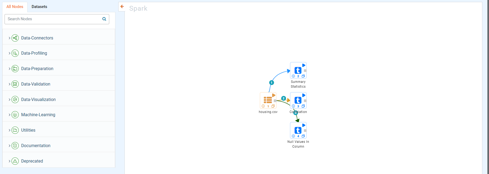

Data Cleaning
=============

1. Data Cleaning
--------

* Data cleaning includes DROP NULL ROWS, REMOVE OUTLIERS, IMPUTE.

   
.. figure:: ../../_assets/user-guide/wf-wizard/data-cleaning1.PNG 
   :alt: Workflow-Wizard
   :width: 80%
   
* After clicking on create whichever checkbox is clicked that node will get attached with node with given values.

.. figure:: ../../_assets/user-guide/wf-wizard/data-cleaning2.PNG 
   :alt: Workflow-Wizard
   :width: 80%
   
   
2. Data Visualization
--------

* Data Visualization includes CHART, DISTRIBUTION, BOXPLOT, TABLE.

   

   
* After clicking on create whichever checkbox is clicked that node will get attached with node with given values.

   
3. Data Profiling
--------

* Data Profiling includes SUMMARY STATISTICS, CORRELATION, NULL VALUES IN COLUMNS.

   

   
* After clicking on create whichever checkbox is clicked that node will get attached with node with given values.

