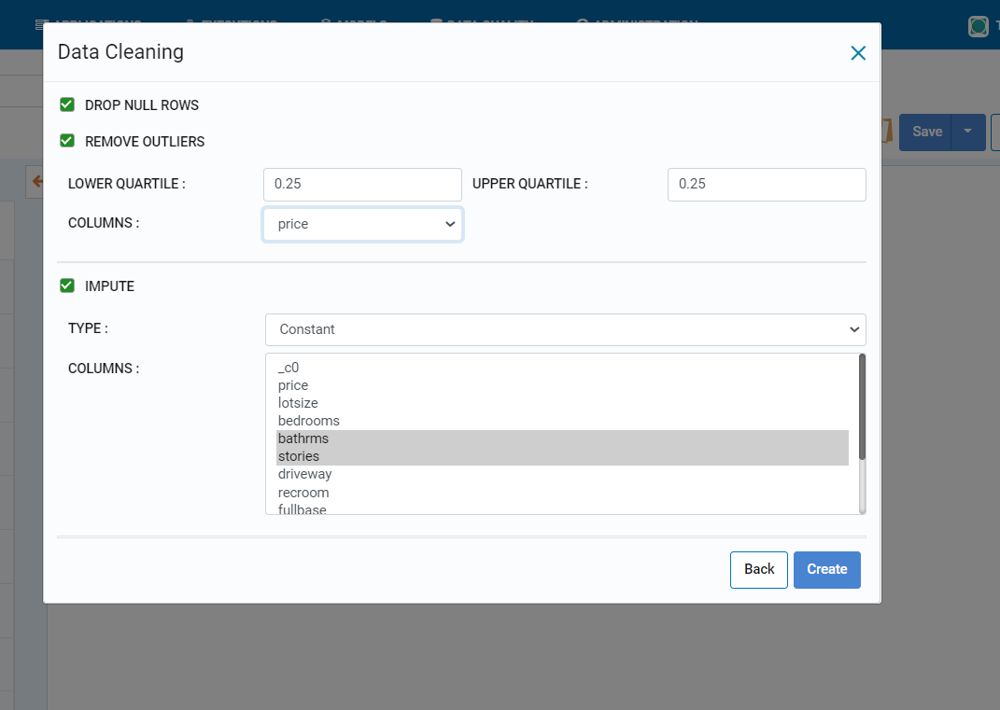
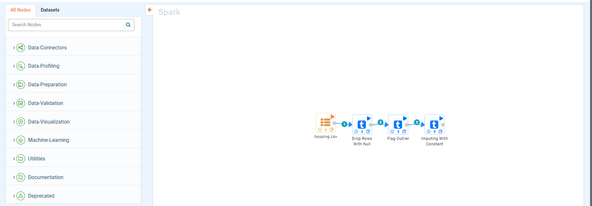

Workflow Wizard
===================

Fire Insights makes it easy to build workflows using the Workflow Wizard.

.. figure:: ../../_assets/user-guide/wf-wizard/1.PNG 
   :alt: Workflow-Wizard
   :width: 80%
   
Fire Insights support workflow wizard for 4 types: 

   
.. figure:: ../../_assets/user-guide/wf-wizard/2.PNG 
   :alt: Workflow-Wizard
   :width: 80%

1. Data Cleaning
--------

* Data cleaning includes drop null rows , remove outliers, impute

   

   
* After clicking on create whichever checkbox is clicked that node will get attched with node with given values

