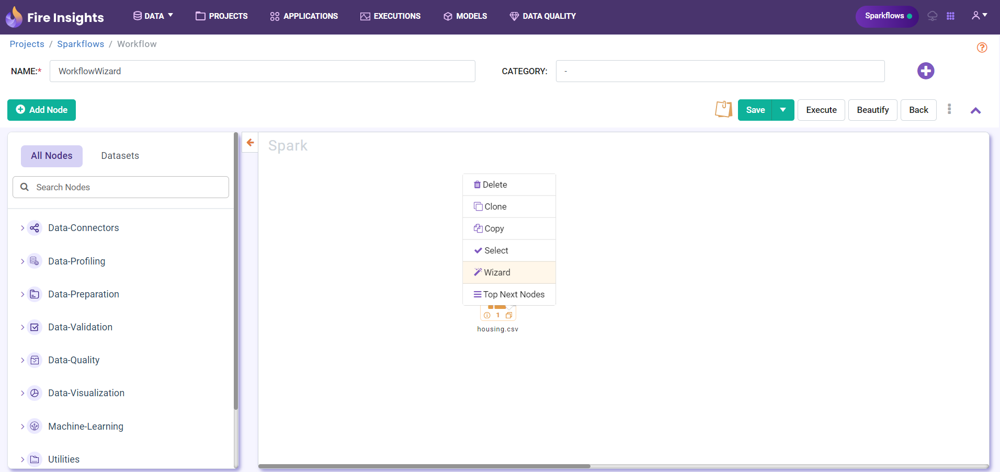
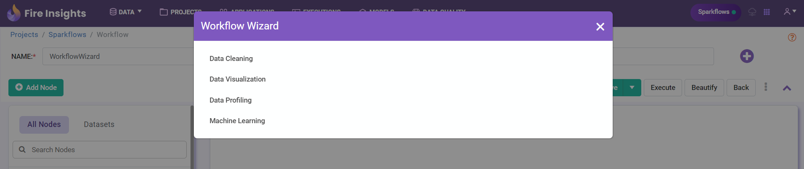

Overview
===================

Sparkflows makes it easy to build workflows using the Workflow Wizard.

   
Sparkflows supports workflow wizard for 4 types: 

1. Data Cleaning 
2. Data Visualization 
3. Data Profiling and 
4. Machine Learning 
   

