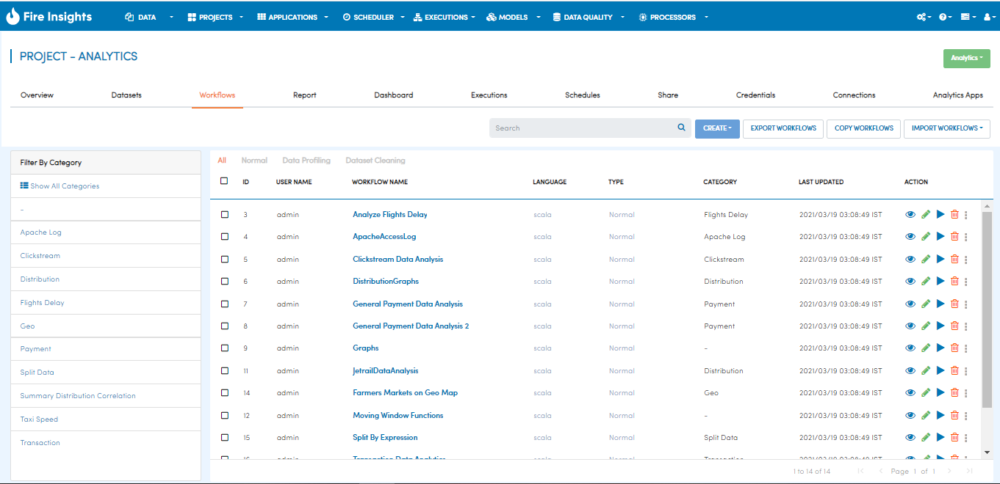
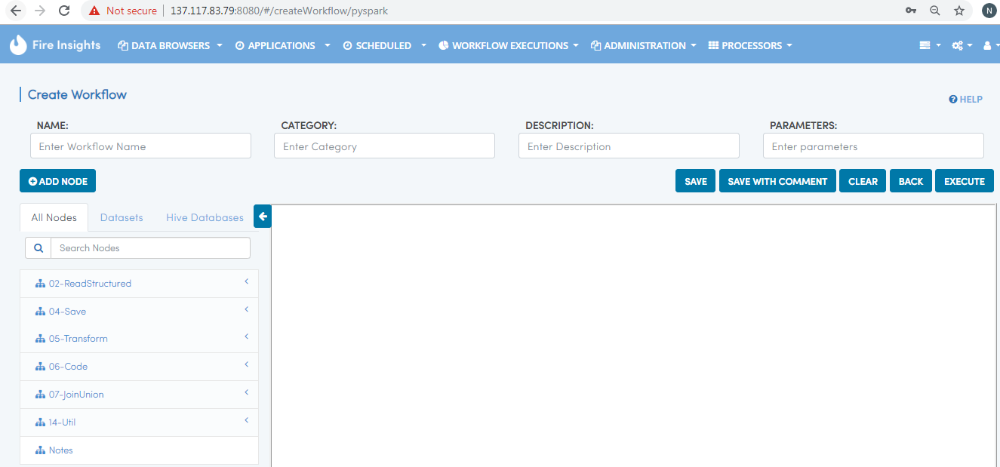

Creating Workflows
------------------

Fire Insights enables users to define end-to-end workflows for data pipelining leveraging pre-packaged nodes for common ETL and Machine Learning models. Workflows are then saved and executed to produce results. Sparkflows provides a a very intuitive and user friendly editor to achieve the same.
 
Selecting Nodes for Workflow Steps
===============

  * Workflows editor has a list of Nodes menu. Clicking on any of the Nodes creates it in the workspace.
 
Creating Edges
===============
 
  * Nodes can be connected by edges.
 
Deleting Edges
===============
 
  * Edges can be deleted by double clicking on them.

View Workflows
===============

You can view the workflows by going to the Workflows Page inside specific applications.

Define New Workflows
===============

Click on 'Create New Workflow' for creating a New Workflow, It has two engines-  scala & pyspark. As per requirment we can select them. It will open the Workflow Editor where Nodes can be created and connected.

- Scala

.. figure:: ../../_assets/user-guide/workflow/2.PNG
   :alt: workflow
   :align: center
   :width: 60%

- Pyspark

