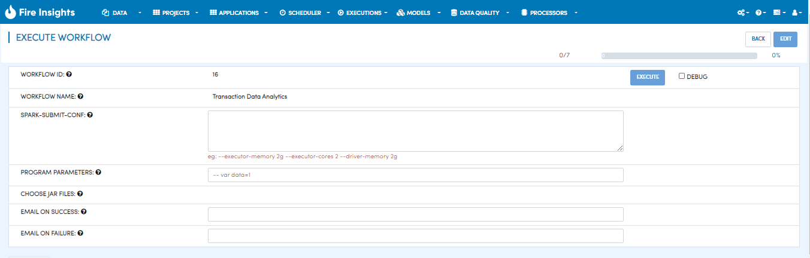
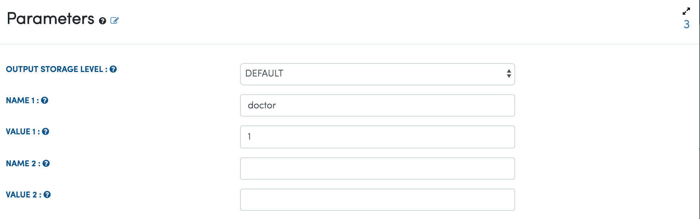
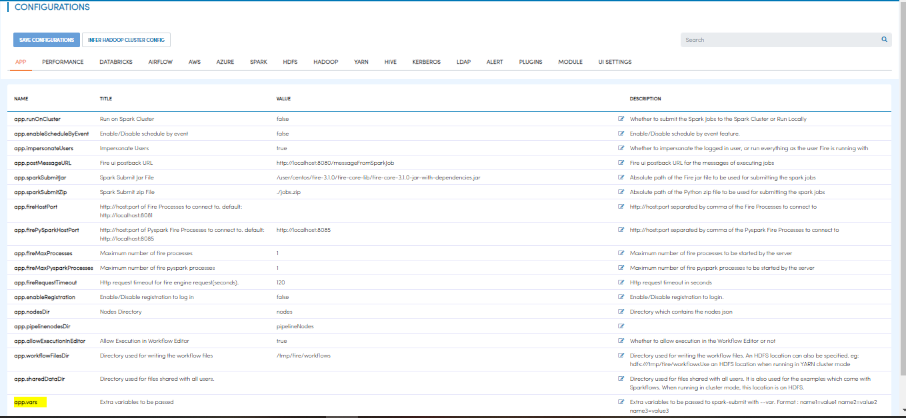

Passing Parameters to Workflows
===============================

Fire Insights runs the spark jobs with ``spark-submit``. It takes in the workflow JSON as a parameter. There are multiple ways to pass extra parameters to the workflow. If the same parameter is specified, the below is also the order of precendence in which they are applied.
 
  * Through Program Parameters in Fire during Workflow Execution
  * By specifying the parameters in the Workflow Editor
  * Through a Parameter Processor in the workflow

Through Program Parameters in Fire during Workflow Execution
------------------------------------------------------------

Key/Value pairs can be passed to Fire during Workflow Execution. An example of it is ``--var doctor=1``
These Key/Value pairs would override any Key/Value pair passed through the Parameter Processor in the workflow.

Below is a screenshot:

By specifying the parameters in the Workflow Editor
---------------------------------------------------

Parameters can be specified in the Workflow Editor. They can be specified in the following format:

They can be passed with ``--var name1=value1  --var  name2=value2``

  
Through a Parameter Processor in the Workflow
-----------------------------------------
 
A Parameter Processor can be added to the workflow. It allows passing key/value pairs to the workflow.

   
   
Through ``--var`` parameters with spark-submit
--------------------------------------------------
 
Fire Insights workflow can also be directly executed on the cluster with spark-submit.

In this case, extra parameters can be passed with ``--var``::

 
    spark-submit    --class fire.execute.WorkflowExecuteFromFile    --master yarn    --deploy-mode client   fire-core-3.1.0-jar-with-dependencies.jar    --postback-url http://<machine>:8080 --job-id 1      --workflow-file kmeans.wf    --var name1=value1  --var  name2=value2

 
In the workflow, these parameters can be used with ``$name1    $name2``
 
Specific nodes make use of the parameters by **substituting   $name   with the value** provided for the name.

An **example** would be :     ``--var id=3``

When specifying the expression in the RowFilter Node we can use :   ``id > $id``

In the above **$id** would be replaced with **3**.
 
 

Specifying ``--var`` parameters for all in Sparkflows User Interface
-----------------------------------------------------------------
 
Sparkflows also allows specifying the **--var** parameters to be passed to all the jobs submitted through Sparkflows. Below is the screen under Administration/Configuration.

   
In the above, **app.vars** parameter allows specifying a space separated list of name=value pairs. 

Each of these are passed to the jobs submitted by Sparkflows with ``--var name=value``
